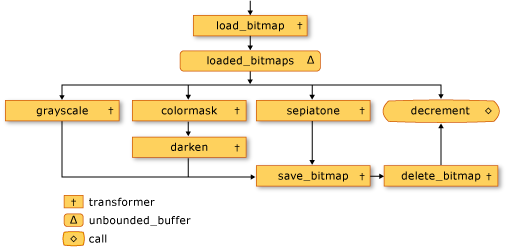
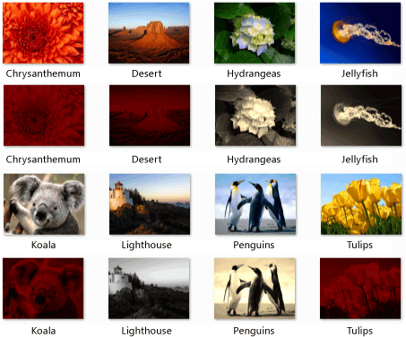

# Walkthrough: Creating an Image-Processing Network
This document demonstrates how to create a network of asynchronous message blocks that perform image processing.  
  
 The network determines which operations to perform on an image on the basis of its characteristics. This example uses the *dataflow* model to route images through the network. In the dataflow model, independent components of a program communicate with one another by sending messages. When a component receives a message, it can perform some action and then pass the result of that action to another component. Compare this with the *control flow* model, in which an application uses control structures, for example, conditional statements, loops, and so on, to control the order of operations in a program.  
  
 A network that is based on dataflow creates a *pipeline* of tasks. Each stage of the pipeline concurrently performs part of the overall task. An analogy to this is an assembly line for automobile manufacturing. As each vehicle passes through the assembly line, one station assembles the frame, another installs the engine, and so on. By enabling multiple vehicles to be assembled simultaneously, the assembly line provides better throughput than assembling complete vehicles one at a time.  
  
## Prerequisites  
 Read the following documents before you start this walkthrough:  
  
-   [Asynchronous Message Blocks](../vs140/asynchronous-message-blocks.md)  
  
-   [How-to: Use a Message Block Filter to Improve Performance](../vs140/how-to--use-a-message-block-filter.md)  
  
-   [Walkthrough: Creating a Dataflow Agent](../vs140/walkthrough--creating-a-dataflow-agent.md)  
  
 We also recommend that you understand the basics of [!INCLUDE[ndptecgdiplus](../vs140/includes/ndptecgdiplus_md.md)] before you start this walkthrough. For more information about [!INCLUDE[ndptecgdiplus](../vs140/includes/ndptecgdiplus_md.md)], see [GDI+](_gdiplus_GDI_start_cpp).  
  
##  \<a name="top">\</a> Sections  
 This walkthrough contains the following sections:  
  
-   [Defining Image Processing Functionality](#functionality)  
  
-   [Creating the Image Processing Network](#network)  
  
-   [The Complete Example](#complete)  
  
##  \<a name="functionality">\</a> Defining Image Processing Functionality  
 This section shows the support functions that the image processing network uses to work with images that are read from disk.  
  
 The following functions, <CodeContentPlaceHolder>0\</CodeContentPlaceHolder> and <CodeContentPlaceHolder>1\</CodeContentPlaceHolder>, extract and combine the individual components of the given color, respectively.  
  
 [!code[concrt-image-processing-filter#2](../vs140/codesnippet/CPP/walkthrough--creating-an-image-processing-network_1.cpp)]  
  
 The following function, <CodeContentPlaceHolder>2\</CodeContentPlaceHolder>, calls the given [std::function](../vs140/function-class.md) object to transform the color value of each pixel in a [!INCLUDE[ndptecgdiplus](../vs140/includes/ndptecgdiplus_md.md)] [Bitmap](https://msdn.microsoft.com/en-us/library/ms534420.aspx) object. The <CodeContentPlaceHolder>3\</CodeContentPlaceHolder> function uses the [concurrency::parallel_for](../vs140/parallel_for-function.md) algorithm to process each row of the bitmap in parallel.  
  
 [!code[concrt-image-processing-filter#3](../vs140/codesnippet/CPP/walkthrough--creating-an-image-processing-network_2.cpp)]  
  
 The following functions, <CodeContentPlaceHolder>4\</CodeContentPlaceHolder>, <CodeContentPlaceHolder>5\</CodeContentPlaceHolder>, <CodeContentPlaceHolder>6\</CodeContentPlaceHolder>, and <CodeContentPlaceHolder>7\</CodeContentPlaceHolder>, call the <CodeContentPlaceHolder>8\</CodeContentPlaceHolder> function to transform the color value of each pixel in a <CodeContentPlaceHolder>9\</CodeContentPlaceHolder> object. Each of these functions uses a lambda expression to define the color transformation of one pixel.  
  
 [!code[concrt-image-processing-filter#4](../vs140/codesnippet/CPP/walkthrough--creating-an-image-processing-network_3.cpp)]  
  
 The following function, <CodeContentPlaceHolder>10\</CodeContentPlaceHolder>, also calls the <CodeContentPlaceHolder>11\</CodeContentPlaceHolder> function. However, instead of changing the value of each color, this function uses [concurrency::combinable](../vs140/combinable-class.md) objects to compute whether the red, green, or blue color component dominates the image.  
  
 [!code[concrt-image-processing-filter#5](../vs140/codesnippet/CPP/walkthrough--creating-an-image-processing-network_4.cpp)]  
  
 The following function, <CodeContentPlaceHolder>12\</CodeContentPlaceHolder>, retrieves the class identifier for the given MIME type of an encoder. The application uses this function to retrieve the encoder for a bitmap.  
  
 [!code[concrt-image-processing-filter#6](../vs140/codesnippet/CPP/walkthrough--creating-an-image-processing-network_5.cpp)]  
  
 [[Top](#top)]  
  
##  \<a name="network">\</a> Creating the Image Processing Network  
 This section describes how to create a network of asynchronous message blocks that perform image processing on every [!INCLUDE[TLA#tla_jpeg](../vs140/includes/tlasharptla_jpeg_md.md)] (.jpg) image in a given directory. The network performs the following image-processing operations:  
  
1.  For any image that is authored by Tom, convert to grayscale.  
  
2.  For any image that has red as the dominant color, remove the green and blue components and then darken it.  
  
3.  For any other image, apply sepia toning.  
  
 The network applies only the first image-processing operation that matches one of these conditions. For example, if an image is authored by Tom and has red as its dominant color, the image is only converted to grayscale.  
  
 After the network performs each image-processing operation, it saves the image to disk as a bitmap (.bmp) file.  
  
 The following steps show how to create a function that implements this image processing network and applies that network to every [!INCLUDE[TLA#tla_jpeg](../vs140/includes/tlasharptla_jpeg_md.md)] image in a given directory.  
  
#### To create the image processing network  
  
1.  Create a function, <CodeContentPlaceHolder>13\</CodeContentPlaceHolder>, that takes the name of a directory on disk.  
  
     [!code[concrt-image-processing-filter#7](../vs140/codesnippet/CPP/walkthrough--creating-an-image-processing-network_6.cpp)]  
  
2.  In the <CodeContentPlaceHolder>14\</CodeContentPlaceHolder> function, create a <CodeContentPlaceHolder>15\</CodeContentPlaceHolder> variable. The <CodeContentPlaceHolder>16\</CodeContentPlaceHolder> class is shown later in this walkthrough.  
  
     [!code[concrt-image-processing-filter#8](../vs140/codesnippet/CPP/walkthrough--creating-an-image-processing-network_7.cpp)]  
  
3.  Create a [std::map](../vs140/map-class.md) object that associates a <CodeContentPlaceHolder>17\</CodeContentPlaceHolder> object with its original file name.  
  
     [!code[concrt-image-processing-filter#9](../vs140/codesnippet/CPP/walkthrough--creating-an-image-processing-network_8.cpp)]  
  
4.  Add the following code to define the members of the image-processing network.  
  
     [!code[concrt-image-processing-filter#10](../vs140/codesnippet/CPP/walkthrough--creating-an-image-processing-network_9.cpp)]  
  
5.  Add the following code to connect the network.  
  
     [!code[concrt-image-processing-filter#11](../vs140/codesnippet/CPP/walkthrough--creating-an-image-processing-network_10.cpp)]  
  
6.  Add the following code to send to the head of the network the full path of each [!INCLUDE[TLA#tla_jpeg](../vs140/includes/tlasharptla_jpeg_md.md)] file in the directory.  
  
     [!code[concrt-image-processing-filter#12](../vs140/codesnippet/CPP/walkthrough--creating-an-image-processing-network_11.cpp)]  
  
7.  Wait for the <CodeContentPlaceHolder>18\</CodeContentPlaceHolder> variable to reach zero.  
  
     [!code[concrt-image-processing-filter#13](../vs140/codesnippet/CPP/walkthrough--creating-an-image-processing-network_12.cpp)]  
  
 The following table describes the members of the network.  
  
|Member|Description|  
|------------|-----------------|  
|<CodeContentPlaceHolder>19\</CodeContentPlaceHolder>|A [concurrency::transformer](../vs140/transformer-class.md) object that loads a <CodeContentPlaceHolder>20\</CodeContentPlaceHolder> object from disk and adds an entry to the <CodeContentPlaceHolder>21\</CodeContentPlaceHolder> object to associate the image with its original file name.|  
|<CodeContentPlaceHolder>22\</CodeContentPlaceHolder>|A [concurrency::unbounded_buffer](../vs140/unbounded_buffer-class.md) object that sends the loaded images to the image processing filters.|  
|<CodeContentPlaceHolder>23\</CodeContentPlaceHolder>|A <CodeContentPlaceHolder>24\</CodeContentPlaceHolder> object that converts images that are authored by Tom to grayscale. It uses the metadata of the image to determine its author.|  
|<CodeContentPlaceHolder>25\</CodeContentPlaceHolder>|A <CodeContentPlaceHolder>26\</CodeContentPlaceHolder> object that removes the green and blue color components from images that have red as the dominant color.|  
|<CodeContentPlaceHolder>27\</CodeContentPlaceHolder>|A <CodeContentPlaceHolder>28\</CodeContentPlaceHolder> object that darkens images that have red as the dominant color.|  
|<CodeContentPlaceHolder>29\</CodeContentPlaceHolder>|A <CodeContentPlaceHolder>30\</CodeContentPlaceHolder> object that applies sepia toning to images that are not authored by Tom and are not predominantly red.|  
|<CodeContentPlaceHolder>31\</CodeContentPlaceHolder>|A <CodeContentPlaceHolder>32\</CodeContentPlaceHolder> object that saves the processed <CodeContentPlaceHolder>33\</CodeContentPlaceHolder> to disk as a bitmap. <CodeContentPlaceHolder>34\</CodeContentPlaceHolder> retrieves the original file name from the <CodeContentPlaceHolder>35\</CodeContentPlaceHolder> object and changes its file name extension to .bmp.|  
|<CodeContentPlaceHolder>36\</CodeContentPlaceHolder>|A <CodeContentPlaceHolder>37\</CodeContentPlaceHolder> object that frees the memory for the images.|  
|<CodeContentPlaceHolder>38\</CodeContentPlaceHolder>|A [concurrency::call](../vs140/call-class.md) object that acts as the terminal node in the network. It decrements the <CodeContentPlaceHolder>39\</CodeContentPlaceHolder> object to signal to the main application that an image has been processed.|  
  
 The <CodeContentPlaceHolder>40\</CodeContentPlaceHolder> message buffer is important because, as an <CodeContentPlaceHolder>41\</CodeContentPlaceHolder> object, it offers <CodeContentPlaceHolder>42\</CodeContentPlaceHolder> objects to multiple receivers. When a target block accepts a <CodeContentPlaceHolder>43\</CodeContentPlaceHolder> object, the <CodeContentPlaceHolder>44\</CodeContentPlaceHolder> object does not offer that <CodeContentPlaceHolder>45\</CodeContentPlaceHolder> object to any other targets. Therefore, the order in which you link objects to an <CodeContentPlaceHolder>46\</CodeContentPlaceHolder> object is important. The <CodeContentPlaceHolder>47\</CodeContentPlaceHolder>, <CodeContentPlaceHolder>48\</CodeContentPlaceHolder>, and <CodeContentPlaceHolder>49\</CodeContentPlaceHolder> message blocks each use a filter to accept only certain <CodeContentPlaceHolder>50\</CodeContentPlaceHolder> objects. The <CodeContentPlaceHolder>51\</CodeContentPlaceHolder> message buffer is an important target of the <CodeContentPlaceHolder>52\</CodeContentPlaceHolder> message buffer because it accepts all <CodeContentPlaceHolder>53\</CodeContentPlaceHolder> objects that are rejected by the other message buffers. An <CodeContentPlaceHolder>54\</CodeContentPlaceHolder> object is required to propagate messages in order. Therefore, an <CodeContentPlaceHolder>55\</CodeContentPlaceHolder> object blocks until a new target block is linked to it and accepts the message if no current target block accepts that message.  
  
 If your application requires that multiple message blocks process the message, instead of just the one message block that first accepts the message, you can use another message block type, such as <CodeContentPlaceHolder>56\</CodeContentPlaceHolder>. The <CodeContentPlaceHolder>57\</CodeContentPlaceHolder> class holds one message at a time, but it propagates that message to each of its targets.  
  
 The following illustration shows the image processing network:  
  
   
  
 The <CodeContentPlaceHolder>58\</CodeContentPlaceHolder> object in this example enables the image processing network to inform the main application when all images have been processed. The <CodeContentPlaceHolder>59\</CodeContentPlaceHolder> class uses a [concurrency::event](../vs140/event-class.md) object to signal when a counter value reaches zero. The main application increments the counter every time that it sends a file name to the network. The terminal node of the network decrements the counter after each image has been processed. After the main application traverses the specified directory, it waits for the <CodeContentPlaceHolder>60\</CodeContentPlaceHolder> object to signal that its counter has reached zero.  
  
 The following example shows the <CodeContentPlaceHolder>61\</CodeContentPlaceHolder> class:  
  
 [!code[concrt-image-processing-filter#14](../vs140/codesnippet/CPP/walkthrough--creating-an-image-processing-network_13.cpp)]  
  
 [[Top](#top)]  
  
##  \<a name="complete">\</a> The Complete Example  
 The following code shows the complete example. The <CodeContentPlaceHolder>62\</CodeContentPlaceHolder> function manages the [!INCLUDE[ndptecgdiplus](../vs140/includes/ndptecgdiplus_md.md)] library and calls the <CodeContentPlaceHolder>63\</CodeContentPlaceHolder> function to process the [!INCLUDE[TLA#tla_jpeg](../vs140/includes/tlasharptla_jpeg_md.md)] files in the <CodeContentPlaceHolder>64\</CodeContentPlaceHolder> directory.  
  
 [!code[concrt-image-processing-filter#15](../vs140/codesnippet/CPP/walkthrough--creating-an-image-processing-network_14.cpp)]  
  
 The following illustration shows sample output. Each source image is above its corresponding modified image.  
  
   
  
 <CodeContentPlaceHolder>65\</CodeContentPlaceHolder> is authored by Tom Alphin and therefore is converted to grayscale. <CodeContentPlaceHolder>66\</CodeContentPlaceHolder>, <CodeContentPlaceHolder>67\</CodeContentPlaceHolder>, <CodeContentPlaceHolder>68\</CodeContentPlaceHolder>, and <CodeContentPlaceHolder>69\</CodeContentPlaceHolder> have red as the dominant color and therefore have the blue and green color components removed and are darkened. <CodeContentPlaceHolder>70\</CodeContentPlaceHolder>, <CodeContentPlaceHolder>71\</CodeContentPlaceHolder>, and <CodeContentPlaceHolder>72\</CodeContentPlaceHolder> match the default criteria and therefore are sepia toned.  
  
 [[Top](#top)]  
  
### Compiling the Code  
 Copy the example code and paste it in a Visual Studio project, or paste it in a file that is named <CodeContentPlaceHolder>73\</CodeContentPlaceHolder> and then run the following command in a Visual Studio Command Prompt window.  
  
 **cl.exe /DUNICODE /EHsc image-processing-network.cpp /link gdiplus.lib**  
  
## See Also  
 [Concurrency Runtime Walkthroughs](../vs140/concurrency-runtime-walkthroughs.md)