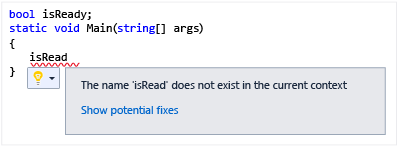
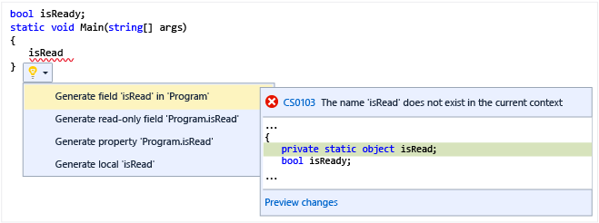
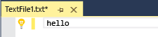
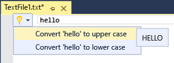

# Walkthrough: Displaying Light Bulb Suggestions
Light bulbs are icons used in the Visual Studio editor that expand to display a set of actions, for example fixes for problems identified by the built-in code analyzers or code refactoring.  
  
 In the Visual C# and Visual Basic editors, you can also use the .NET Compiler Platform (“Roslyn”) to write and package your own code analyzers with actions that display light bulbs automatically. For more information, see:  
  
-   [How To: Write a C# Diagnostic and Code Fix](https://github.com/dotnet/roslyn/wiki/How-To-Write-a-C%23-Analyzer-and-Code-Fix)  
  
-   [How To: Write a Visual Basic Diagnostic and Code Fix](https://github.com/dotnet/roslyn/wiki/How-To-Write-a-Visual-Basic-Analyzer-and-Code-Fix)  
  
 Other languages such as C++ also provide light bulbs for some quick actions, such as a suggestion to create a stub implementation of that function.  
  
 Here’s what a light bulb looks like. In a Visual Basic or Visual C# project, a red squiggle appears under a variable name when it is invalid. When you mouse over the invalid identifier, a light bulb is displayed near the cursor.  
  
   
  
 If you click the down arrow by the light bulb, a set of suggested actions is displayed, along with a preview of the selected action. In this case, it shows the changes that will be made to your code if you execute the action.  
  
   
  
 You can use light bulbs to provide your own suggested actions. For example, you could provide actions to move opening curly braces to a new line or move them to the end of the preceding line. The following walkthrough shows how to create a light bulb that appears on the current word and has two suggested actions: **Convert to upper case** and **Convert to lower case**.  
  
## Prerequisites  
 Starting in Visual Studio 2015, you do not install the Visual Studio SDK from the download center. It is included as an optional feature in Visual Studio setup. You can also install the VS SDK later on. For more information, see [Installing the Visual Studio SDK](../vs140/installing-the-visual-studio-sdk.md).  
  
## Creating a Managed Extensibility Framework (MEF) Project  
  
1.  Create a C# VSIX project. (In the **New Project** dialog, select **Visual C# / Extensibility**, then **VSIX Project**.) Name the solution <CodeContentPlaceHolder>21\</CodeContentPlaceHolder>.  
  
2.  Add an **Editor Classifier** item template to the project. For more information, see [Creating an Extension with an Editor Item Template](../vs140/creating-an-extension-with-an-editor-item-template.md).  
  
3.  Delete the existing class files.  
  
4.  Add the following reference to the project, and set **Copy Local** to <CodeContentPlaceHolder>22\</CodeContentPlaceHolder>:  
  
     Microsoft.VisualStudio.Language.Intellisense  
  
5.  Add a new class file and name it **LightBulbTest**.  
  
6.  Add the following using statements:  
  
<CodeContentPlaceHolder>0\</CodeContentPlaceHolder>  
## Implementing the Light Bulb Source Provider  
  
1.  In the LightBulbTest.cs class file, delete the LightBulbTest class. Add a class named **TestSuggestedActionsSourceProvider** that implements \<xref:Microsoft.VisualStudio.Language.Intellisense.ISuggestedActionsSourceProvider*>. Export it with a Name of **Test Suggested Actions** and a \<xref:Microsoft.VisualStudio.Utilities.ContentTypeAttribute*> of "text".  
  
<CodeContentPlaceHolder>1\</CodeContentPlaceHolder>  
2.  Inside the source provider class, import the \<xref:Microsoft.VisualStudio.Text.Operations.ITextStructureNavigatorSelectorService*> and add it as a property.  
  
<CodeContentPlaceHolder>2\</CodeContentPlaceHolder>  
3.  Implement the \<xref:Microsoft.VisualStudio.Language.Intellisense.ISuggestedActionsSourceProvider.CreateSuggestedActionsSource*> method to return an \<xref:Microsoft.VisualStudio.Language.Intellisense.ISuggestedActionsSource*> object. We will discuss the source in the next section.  
  
<CodeContentPlaceHolder>3\</CodeContentPlaceHolder>  
## Implementing the ISuggestedActionSource  
 The suggested action source is responsible for collecting the set of suggested actions and adding them in the right context. In this case the context is the current word and the suggested actions are **UpperCaseSuggestedAction** and **LowerCaseSuggestedAction**, which we will discuss in the following section.  
  
1.  Add a class **TestSuggestedActionsSource** that implements \<xref:Microsoft.VisualStudio.Language.Intellisense.ISuggestedActionsSource*>.  
  
<CodeContentPlaceHolder>4\</CodeContentPlaceHolder>  
2.  Add private read-only fields for the suggested action source provider, the text buffer and the text view.  
  
<CodeContentPlaceHolder>5\</CodeContentPlaceHolder>  
3.  Add a constructor that sets the private fields.  
  
<CodeContentPlaceHolder>6\</CodeContentPlaceHolder>  
4.  Add a private method that returns the word that is currently under the cursor. The following method looks at the current location of the cursor and asks the text structure navigator for the extent of the word. If the cursor is on a word, the \<xref:Microsoft.VisualStudio.Text.Operations.TextExtent*> is returned in the out parameter; otherwise the <CodeContentPlaceHolder>23\</CodeContentPlaceHolder> parameter is <CodeContentPlaceHolder>24\</CodeContentPlaceHolder> and the method returns <CodeContentPlaceHolder>25\</CodeContentPlaceHolder>.  
  
<CodeContentPlaceHolder>7\</CodeContentPlaceHolder>  
5.  Implement the \<xref:Microsoft.VisualStudio.Language.Intellisense.ISuggestedActionsSource.HasSuggestedActionsAsync*> method. The editor calls this method to find out whether to display the light bulb. This call is made quite often, for example whenever the cursor moves from one line to another, or when the mouse hovers over an error squiggle. It is asynchronous in order to allow other UI operations to carry on while this method is working. In most cases this method needs to perform some parsing and analysis of the current line, so the processing may take some time.  
  
     In our implementation it asynchronously gets the \<xref:Microsoft.VisualStudio.Text.Operations.TextExtent*> and determines whether the extent is significant, i.e., whether it has some text other than whitespace.  
  
<CodeContentPlaceHolder>8\</CodeContentPlaceHolder>  
6.  Implement the \<xref:Microsoft.VisualStudio.Language.Intellisense.ISuggestedActionsSource.GetSuggestedActions*> method, which returns an array of \<xref:Microsoft.VisualStudio.Language.Intellisense.SuggestedActionSet*> objects that contain the different \<xref:Microsoft.VisualStudio.Language.Intellisense.ISuggestedAction*> objects. This method is called when the light bulb is expanded.  
  
    > [!WARNING]
    >  You should make sure that the implementations of <CodeContentPlaceHolder>26\</CodeContentPlaceHolder> and <CodeContentPlaceHolder>27\</CodeContentPlaceHolder> are consistent; that is, if <CodeContentPlaceHolder>28\</CodeContentPlaceHolder> returns <CodeContentPlaceHolder>29\</CodeContentPlaceHolder>, then <CodeContentPlaceHolder>30\</CodeContentPlaceHolder> should have some actions to display. In many cases <CodeContentPlaceHolder>31\</CodeContentPlaceHolder> is called just before <CodeContentPlaceHolder>32\</CodeContentPlaceHolder>, but this is not always the case. For example, if the user invokes the light bulb actions by pressing (CTRL + .) only <CodeContentPlaceHolder>33\</CodeContentPlaceHolder> is called.  
  
<CodeContentPlaceHolder>9\</CodeContentPlaceHolder>  
7.  Define a <CodeContentPlaceHolder>34\</CodeContentPlaceHolder> event.  
  
<CodeContentPlaceHolder>10\</CodeContentPlaceHolder>  
8.  To complete the implementation, add implementations for the <CodeContentPlaceHolder>35\</CodeContentPlaceHolder> and <CodeContentPlaceHolder>36\</CodeContentPlaceHolder> methods. We don’t want to do telemetry, so just return false and set the GUID to Empty.  
  
<CodeContentPlaceHolder>11\</CodeContentPlaceHolder>  
## Implementing Light Bulb Actions  
  
1.  In the project, add a reference to Microsoft.VisualStudio.Imaging.Interop.14.0.DesignTime.dll and set **Copy Local** to <CodeContentPlaceHolder>37\</CodeContentPlaceHolder>.  
  
2.  Create two classes, the first named <CodeContentPlaceHolder>38\</CodeContentPlaceHolder> and the second named <CodeContentPlaceHolder>39\</CodeContentPlaceHolder>. Both classes implement \<xref:Microsoft.VisualStudio.Language.Intellisense.ISuggestedAction*>.  
  
<CodeContentPlaceHolder>12\</CodeContentPlaceHolder>  
     Both classes are alike except that one calls \<xref:System.String.ToUpper*> and the other calls \<xref:System.String.ToLower*>. The following steps cover only the uppercase action class, but you must implement both classes. Use the steps for implementing the uppercase action as a pattern for implementing the lowercase action.  
  
3.  Add the following using statements for these classes:  
  
<CodeContentPlaceHolder>13\</CodeContentPlaceHolder>  
4.  Declare a set of private fields.  
  
<CodeContentPlaceHolder>14\</CodeContentPlaceHolder>  
5.  Add a constructor that sets the fields.  
  
<CodeContentPlaceHolder>15\</CodeContentPlaceHolder>  
6.  Implement the \<xref:Microsoft.VisualStudio.Language.Intellisense.ISuggestedAction.GetPreviewAsync*> method so that it displays the action preview.  
  
<CodeContentPlaceHolder>16\</CodeContentPlaceHolder>  
7.  Implement the \<xref:Microsoft.VisualStudio.Language.Intellisense.ISuggestedAction.GetActionSetsAsync*> method so that it returns an empty \<xref:Microsoft.VisualStudio.Language.Intellisense.SuggestedActionSet*> enumeration.  
  
<CodeContentPlaceHolder>17\</CodeContentPlaceHolder>  
8.  Implement the properties as follows.  
  
<CodeContentPlaceHolder>18\</CodeContentPlaceHolder>  
9. Implement the \<xref:Microsoft.VisualStudio.Language.Intellisense.ISuggestedAction.Invoke*> method by replacing the text in the span with its uppercase equivalent.  
  
<CodeContentPlaceHolder>19\</CodeContentPlaceHolder>  
    > [!WARNING]
    >  The light bulb action **Invoke** method is not expected to show UI.  If your action does bring up new UI (for example a preview or selection dialog), do not display the UI directly from within the **Invoke** method but instead schedule to display your UI after returning from **Invoke**.  
  
10. To complete the implementation, add the <CodeContentPlaceHolder>40\</CodeContentPlaceHolder> and <CodeContentPlaceHolder>41\</CodeContentPlaceHolder> methods.  
  
<CodeContentPlaceHolder>20\</CodeContentPlaceHolder>  
11. Don’t forget to do the same thing for <CodeContentPlaceHolder>42\</CodeContentPlaceHolder> changing the display text to “Convert ‘{0}’ to lower case” and the call \<xref:System.String.ToUpper*> to \<xref:System.String.ToLower*>.  
  
## Building and Testing the Code  
 To test this code, build the LightBulbTest solution and run it in the Experimental instance.  
  
1.  Build the solution.  
  
2.  When you run this project in the debugger, a second instance of Visual Studio is instantiated.  
  
3.  Create a text file and type some text. You should see a light bulb to the left of the text.  
  
       
  
4.  Point at the light bulb. You should see a down arrow.  
  
5.  When you click the light bulb, two suggested actions should be displayed, along with the preview of the selected action.  
  
       
  
6.  If you click the first action, all the text in the current word should be converted to upper case. If you click the second action, all the text should be converted to lower case.