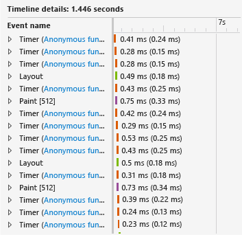
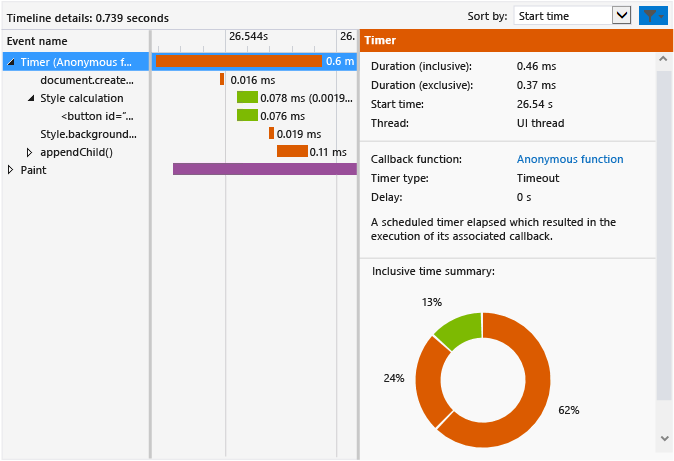

# Walkthrough: Improving UI responsiveness (HTML)
This walkthrough leads you through the process of identifying and fixing a performance issue by using the [HTML UI responsiveness profiler](../vs140/html-ui-responsiveness.md). The profiler is available in Visual Studio for Windows Universal and Windows Store apps  using JavaScript. In this scenario, you create a performance test app that updates DOM elements too frequently, and you use the profiler to identify and fix this problem.  
  
### Creating and running the performance test app  
  
1.  In Visual Studio, create a new Windows Universal JavaScript project. (Select **File / New / Project**. Choose **JavaScript** in the left pane, and then choose **Windows**, **Windows 10**, then either **Universal**, or **Windows Phone**.  
  
2.  > [!IMPORTANT]
    >  The diagnostic results shown in this topic are shown fora Windows 8 app.  
  
3.  Choose one of the blank project templates in the middle pane, such as **Blank App**.  
  
4.  In the **Name** box, specify a name such as `JS_Perf_Tester`, and then choose **OK**.  
  
5.  In **Solution Explorer**, open default.html and paste the following code between the \<body> tags:  
  
    ```html  
    <div class="wrapper">  
        <button id="content">Waiting for values</button>  
    </div>  
    ```  
  
6.  Open default.css and add the following CSS code:  
  
    ```css  
    #content {  
        margin-left: 100px;  
        margin-top: 100px;  
    }  
    ```  
  
7.  Open default.js and replace all the code with this code:  
  
    ```javascript  
    (function () {  
        "use strict";  
  
        var app = WinJS.Application;  
        var activation = Windows.ApplicationModel.Activation;  
  
        var content;  
        var wrapper;  
  
        app.onactivated = function (args) {  
            if (args.detail.kind === activation.ActivationKind.launch) {  
                if (args.detail.previousExecutionState !== activation.ApplicationExecutionState.terminated) {  
  
                    content = document.getElementById("content");  
                    wrapper = document.querySelector(".wrapper");  
  
                    content.addEventListener("click", handler);  
  
                } else {  
                }  
  
                args.setPromise(WinJS.UI.processAll());  
            }  
        };  
  
        app.oncheckpoint = function (args) {  
        };  
  
        app.start();  
  
        var idx = 0;  
        var count = 0;  
        var max = 5000;  
        var text = ["what", "is", "the", "Matrix?"];  
        var color = ["red", "crimson", "maroon", "purple"];  
  
        function increment() {  
  
            setTimeout(function () {  
  
                idx++;  
                count++;  
  
                if (idx > 3) { idx = 0; }  
                if (count < max) { increment(); }  
  
            }, 1000);  
        }  
  
        function setValues() {  
  
            content = document.getElementById("content");  
            content.removeNode(true);  
  
            var newNode = document.createElement("button");  
            newNode.id = "content";  
            newNode.textContent = text[idx];  
            //newNode.textContent = getData();  
            newNode.style.backgroundColor = color[idx];  
            //newNode.style.animationName = "move";  
            //count++;  
  
            wrapper.appendChild(newNode);  
  
        }  
  
        function update() {  
  
            setTimeout(function () {  
  
                setValues();  
                if (count < max) { update(); }  
            });  
        }  
  
        function handler(args) {  
  
            content.textContent = "eenie";  
            increment();  
            update();  
        }  
  
    })();  
  
    ```  
  
8.  Choose the F5 key to start debugging. Verify that the **Waiting for values** button appears on the page.  
  
9. Choose **Waiting for values** and verify that the button text and color update approximately once per second. This is by design.  
  
10. Switch back to Visual Studio (Alt+Tab), and then choose Shift+F5 to stop debugging.  
  
     Now that you've verified that the app works, you can examine its performance by using the profiler.  
  
### Analyzing performance data  
  
1.  On the **Debug** toolbar, in the **Start Debugging** list, choose one of the Windows Phone Emulators or **Simulator**.  
  
2.  On the **Debug** menu, choose **Performance and Diagnostics**.  
  
3.  In **Available Tools**, choose **HTML UI Responsiveness**, and then choose **Start**.  
  
     In this tutorial, you'll be attaching the profiler to the startup project. For info about other options, like attaching the profiler to an installed app, see [Analyze UI responsiveness](../vs140/html-ui-responsiveness.md).  
  
     When you start the profiler, you might see a User Account Control requesting your permission to run VsEtwCollector.exe. Choose **Yes**.  
  
4.  In the running app, choose **Waiting for values** and wait about 10 seconds. Verify that the button text and color update approximately once per second.  
  
5.  From the running app, switch to Visual Studio (Alt+Tab).  
  
6.  Choose **Stop collection**.  
  
     The profiler displays information in a new tab in Visual Studio. When you look at the CPU utilization and visual throughput (FPS) data, you can easily identify a few trends:  
  
    -   CPU utilization increases dramatically after about 3 seconds (when you pressed the **Waiting for values** button) and shows a clear pattern of events (a consistent mix of scripting, styling, and rendering events) from this point on.  
  
    -   Visual throughput isn't impacted, and FPS remains at 60 throughout (that is, there are no dropped frames).  
  
     Let's look at a typical section of the CPU utilization graph to find out what the app is doing in this period of high activity.  
  
7.  Select a one-to-two second portion in the middle of the CPU utilization graph (either click-and-drag or use the tab and arrow keys). The following illustration shows the CPU utilization graph after making a selection. The non-shared area is the selection.  
  
       
  
8.  Choose **Zoom in**.  
  
     The graph changes to show the selected period in more detail. The following illustration shows the CPU utilization graph after zooming in. (The specific data may vary, but the general pattern will be apparent.)  
  
       
  
     The Timeline details in the lower pane shows an example of details for the selected period.  
  
       
  
     The events in the Timeline details confirm visible trends in the CPU utilization graph: there are a lot of events taking place over short periods of time. The Timeline details view shows that these events are `Timer`, `Layout`, and `Paint` events.  
  
9. Use the context menu (or right-click) one of the `Timer` events in the lower pane, and choose **Filter to event**. The following illustration shows an example of details typical for one of the `Timer` events in this test app.  
  
       
  
     A variety of facts may be gleaned from the data. For example:  
  
    -   Each `Timer` event, color-coded to identify it as a scripting event, includes a call to `document.createElement`, followed by a style calculation and a call to `style.backgroundColor` and `appendChild()`.  
  
    -   In the short time span selected (approximately one to two seconds), there are a great number of `Timer`, `Layout`, and `Paint` events taking place. The `Timer` events occur far more frequently than the one update per second that is visibly apparent after you run the app and choose the **Waiting for values** button.  
  
10. To investigate, choose the link to the anonymous function for one of the `Timer` events in the lower left pane. The following function opens in default.js:  
  
    ```javascript  
    function update() {  
  
        setTimeout(function () {  
  
            setValues();  
            if (count < max) { update(); }  
        });  
    }  
    ```  
  
     This recursive function sets up a loop that calls the `setValues()` function, which updates the button in the UI. By examining the different timer events in the profiler, you discover that most or all of the timer events result from this code, which is running too frequently, so it appears likely that the problem originates here.  
  
### Fixing the performance issue  
  
1.  Replace the `update()` function with the following code:  
  
    ```javascript  
    function update() {  
  
        setTimeout(function () {  
  
            setValues();  
            if (count < max) { update(); }  
        }, 1000 );  
    }  
    ```  
  
     This fixed version of the code includes a 1000 millisecond delay, which was omitted from the previous version of the code, resulting in the use of a default delay value. From profiler data, it appears that the default value is zero milliseconds, which caused the `setValues()` function to run too frequently.  
  
2.  Run the HTML UI responsiveness profiler again, and check the CPU utilization graph. You will find that the excessive events are gone, and CPU utilization has dropped to near zero. Fixed!  
  
## See Also  
 [Analyze UI responsiveness](../vs140/html-ui-responsiveness.md)