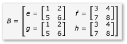

# Walkthrough: Matrix Multiplication
This step-by-step walkthrough demonstrates how to use C++ AMP to accelerate the execution of matrix multiplication. Two algorithms are presented, one without tiling and one with tiling.  
  
## Prerequisites  
 Before you start:  
  
-   Read [Overview of C++ Accelerated Massive Parallelism (C++ AMP)](../vs140/c---amp-overview.md).  
  
-   Read [Using Tiles](../vs140/using-tiles.md).  
  
-   Make sure that [!INCLUDE[win7](../vs140/includes/win7_md.md)], [!INCLUDE[win8](../vs140/includes/win8_md.md)], [!INCLUDE[winsvr08_r2](../vs140/includes/winsvr08_r2_md.md)], or [!INCLUDE[winserver8](../vs140/includes/winserver8_md.md)] is installed on your computer.  
  
### To create the project  
  
1.  On the menu bar in Visual Studio, choose **File**, **New**, **Project**.  
  
2.  Under **Installed** in the templates pane, select **Visual C++**.  
  
3.  Select **Empty Project**, enter <CodeContentPlaceHolder>6\</CodeContentPlaceHolder> in the **Name** box, and then choose the **OK** button.  
  
4.  Choose the **Next** button.  
  
5.  In **Solution Explorer**, open the shortcut menu for **Source Files**, and then choose **Add**, **New Item**.  
  
6.  In the **Add New Item** dialog box, select **C++ File (.cpp)**, enter <CodeContentPlaceHolder>7\</CodeContentPlaceHolder> in the **Name** box, and then choose the **Add** button.  
  
## Multiplication without tiling  
 In this section, consider the multiplication of two matrices, A and B, which are defined as follows:  
  
   
  
   
  
 A is a 3-by-2 matrix and B is a 2-by-3 matrix. The product of multiplying A by B is the following 3-by-3 matrix. The product is calculated by multiplying the rows of A by the columns of B element by element.  
  
   
  
### To multiply without using C++ AMP  
  
1.  Open MatrixMultiply.cpp and use the following code to replace the existing code.  
  
<CodeContentPlaceHolder>0\</CodeContentPlaceHolder>  
     The algorithm is a straightforward implementation of the definition of matrix multiplication. It does not use any parallel or threaded algorithms to reduce the computation time.  
  
2.  On the menu bar, choose **File**, **Save All**.  
  
3.  Choose the F5 keyboard shortcut to start debugging and verify that the output is correct.  
  
4.  Choose Enter to exit the application.  
  
### To multiply by using C++ AMP  
  
1.  In MatrixMultiply.cpp, add the following code before the <CodeContentPlaceHolder>8\</CodeContentPlaceHolder> method.  
  
<CodeContentPlaceHolder>1\</CodeContentPlaceHolder>  
     The AMP code resembles the non-AMP code. The call to <CodeContentPlaceHolder>9\</CodeContentPlaceHolder> starts one thread for each element in <CodeContentPlaceHolder>10\</CodeContentPlaceHolder>, and replaces the <CodeContentPlaceHolder>11\</CodeContentPlaceHolder> loops for row and column. The value of the cell at the row and column is available in <CodeContentPlaceHolder>12\</CodeContentPlaceHolder>. You can access the elements of an <CodeContentPlaceHolder>13\</CodeContentPlaceHolder> object by using either the <CodeContentPlaceHolder>14\</CodeContentPlaceHolder> operator and an index variable, or the <CodeContentPlaceHolder>15\</CodeContentPlaceHolder> operator and the row and column variables. The example demonstrates both methods. The <CodeContentPlaceHolder>16\</CodeContentPlaceHolder> method copies the values of the <CodeContentPlaceHolder>17\</CodeContentPlaceHolder> variable back to the <CodeContentPlaceHolder>18\</CodeContentPlaceHolder> variable.  
  
2.  Add the following <CodeContentPlaceHolder>19\</CodeContentPlaceHolder> and <CodeContentPlaceHolder>20\</CodeContentPlaceHolder> statements at the top of MatrixMultiply.cpp.  
  
<CodeContentPlaceHolder>2\</CodeContentPlaceHolder>  
3.  Modify the <CodeContentPlaceHolder>21\</CodeContentPlaceHolder> method to call the <CodeContentPlaceHolder>22\</CodeContentPlaceHolder> method.  
  
<CodeContentPlaceHolder>3\</CodeContentPlaceHolder>  
4.  Choose the Ctrl+F5 keyboard shortcut to start debugging and verify that the output is correct.  
  
5.  Choose the spacebar to exit the application.  
  
## Multiplication with tiling  
 Tiling is a technique in which you partition data into equal-sized subsets, which are known as tiles. Three things change when you use tiling.  
  
-   You can create <CodeContentPlaceHolder>23\</CodeContentPlaceHolder> variables. Access to data in <CodeContentPlaceHolder>24\</CodeContentPlaceHolder> space can be many times faster than access to data in the global space. An instance of a <CodeContentPlaceHolder>25\</CodeContentPlaceHolder> variable is created for each tile, and all threads in the tile have access to the variable. The primary benefit of tiling is the performance gain due to <CodeContentPlaceHolder>26\</CodeContentPlaceHolder> access.  
  
-   You can call the [tile_barrier::wait](../vs140/tile_barrier--wait-method.md) method to stop all of the threads in one tile at a specified line of code. You cannot guarantee the order that the threads will run in, only that all of the threads in one tile will stop at the call to <CodeContentPlaceHolder>27\</CodeContentPlaceHolder> before they continue execution.  
  
-   You have access to the index of the thread relative to the entire <CodeContentPlaceHolder>28\</CodeContentPlaceHolder> object and the index relative to the tile. By using the local index, you can make your code easier to read and debug.  
  
 To take advantage of tiling in matrix multiplication, the algorithm must partition the matrix into tiles and then copy the tile data into <CodeContentPlaceHolder>29\</CodeContentPlaceHolder> variables for faster access. In this example, the matrix is partitioned into submatrices of equal size. The product is found by multiplying the submatrices. The two matrices and their product in this example are:  
  
   
  
   
  
   
  
 The matrices are partitioned into four 2x2 matrices, which are defined as follows:  
  
   
  
   
  
 The product of A and B can now be written and calculated as follows:  
  
   
  
 Because matrices <CodeContentPlaceHolder>30\</CodeContentPlaceHolder> through <CodeContentPlaceHolder>31\</CodeContentPlaceHolder> are 2x2 matrices, all of the products and sums of them are also 2x2 matrices. It also follows that A*B is a 4x4 matrix, as expected. To quickly check the algorithm, calculate the value of the element in the first row, first column in the product. In the example, that would be the value of the element in the first row and first column of <CodeContentPlaceHolder>32\</CodeContentPlaceHolder>. You only have to calculate the first column, first row of <CodeContentPlaceHolder>33\</CodeContentPlaceHolder> and <CodeContentPlaceHolder>34\</CodeContentPlaceHolder> for each term. That value for <CodeContentPlaceHolder>35\</CodeContentPlaceHolder> is <CodeContentPlaceHolder>36\</CodeContentPlaceHolder>. The value for <CodeContentPlaceHolder>37\</CodeContentPlaceHolder> is <CodeContentPlaceHolder>38\</CodeContentPlaceHolder>. The final value is <CodeContentPlaceHolder>39\</CodeContentPlaceHolder>, which is correct.  
  
 To implement this algorithm, the code:  
  
-   Uses a <CodeContentPlaceHolder>40\</CodeContentPlaceHolder> object instead of an <CodeContentPlaceHolder>41\</CodeContentPlaceHolder> object in the <CodeContentPlaceHolder>42\</CodeContentPlaceHolder> call.  
  
-   Uses a <CodeContentPlaceHolder>43\</CodeContentPlaceHolder> object instead of an <CodeContentPlaceHolder>44\</CodeContentPlaceHolder> object in the <CodeContentPlaceHolder>45\</CodeContentPlaceHolder> call.  
  
-   Creates <CodeContentPlaceHolder>46\</CodeContentPlaceHolder> variables to hold the submatrices.  
  
-   Uses the <CodeContentPlaceHolder>47\</CodeContentPlaceHolder> method to stop the threads for the calculation of the products of the submatrices.  
  
### To multiply by using AMP and tiling  
  
1.  In MatrixMultiply.cpp, add the following code before the <CodeContentPlaceHolder>48\</CodeContentPlaceHolder> method.  
  
<CodeContentPlaceHolder>4\</CodeContentPlaceHolder>  
     This example is significantly different than the example without tiling. The code uses these conceptual steps:  
  
    1.  Copy the elements of tile[0,0] of <CodeContentPlaceHolder>49\</CodeContentPlaceHolder> into <CodeContentPlaceHolder>50\</CodeContentPlaceHolder>. Copy the elements of tile[0,0] of <CodeContentPlaceHolder>51\</CodeContentPlaceHolder> into <CodeContentPlaceHolder>52\</CodeContentPlaceHolder>. Notice that <CodeContentPlaceHolder>53\</CodeContentPlaceHolder> is tiled, not <CodeContentPlaceHolder>54\</CodeContentPlaceHolder> and <CodeContentPlaceHolder>55\</CodeContentPlaceHolder>. Therefore, you use global indices to access <CodeContentPlaceHolder>56\</CodeContentPlaceHolder>, and <CodeContentPlaceHolder>57\</CodeContentPlaceHolder>. The call to <CodeContentPlaceHolder>58\</CodeContentPlaceHolder> is essential. It stops all of the threads in the tile until both <CodeContentPlaceHolder>59\</CodeContentPlaceHolder> and <CodeContentPlaceHolder>60\</CodeContentPlaceHolder> are filled.  
  
    2.  Multiply <CodeContentPlaceHolder>61\</CodeContentPlaceHolder> and <CodeContentPlaceHolder>62\</CodeContentPlaceHolder> and put the results in <CodeContentPlaceHolder>63\</CodeContentPlaceHolder>.  
  
    3.  Copy the elements of tile[0,1] of <CodeContentPlaceHolder>64\</CodeContentPlaceHolder> into <CodeContentPlaceHolder>65\</CodeContentPlaceHolder>. Copy the elements of tile [1,0] of <CodeContentPlaceHolder>66\</CodeContentPlaceHolder> into <CodeContentPlaceHolder>67\</CodeContentPlaceHolder>.  
  
    4.  Multiply <CodeContentPlaceHolder>68\</CodeContentPlaceHolder> and <CodeContentPlaceHolder>69\</CodeContentPlaceHolder> and add them to the results that are already in <CodeContentPlaceHolder>70\</CodeContentPlaceHolder>.  
  
    5.  The multiplication of tile[0,0] is complete.  
  
    6.  Repeat for the other four tiles. There is no indexing specifically for the tiles and the threads can execute in any order. As each thread executes, the <CodeContentPlaceHolder>71\</CodeContentPlaceHolder> variables are created for each tile appropriately and the call to <CodeContentPlaceHolder>72\</CodeContentPlaceHolder> controls the program flow.  
  
    7.  As you examine the algorithm closely, notice that each submatrix is loaded into a <CodeContentPlaceHolder>73\</CodeContentPlaceHolder> memory twice. That data transfer does take time. However, once the data is in <CodeContentPlaceHolder>74\</CodeContentPlaceHolder> memory, access to the data is much faster. Because calculating the products requires repeated access to the values in the submatrices, there is an overall performance gain. For each algorithm, experimentation is required to find the optimal algorithm and tile size.  
  
         In the non-AMP and non-tile examples, each element of A and B is accessed four times from the global memory to calculate the product. In the tile example, each element is accessed twice from the global memory and four times from the <CodeContentPlaceHolder>75\</CodeContentPlaceHolder> memory. That is not a significant performance gain. However, if the A and B were 1024x1024 matrices and the tile size were 16, there would be a significant performance gain. In that case, each element would be copied into <CodeContentPlaceHolder>76\</CodeContentPlaceHolder> memory only 16 times and accessed from <CodeContentPlaceHolder>77\</CodeContentPlaceHolder> memory 1024 times.  
  
2.  Modify the main method to call the <CodeContentPlaceHolder>78\</CodeContentPlaceHolder> method, as shown.  
  
<CodeContentPlaceHolder>5\</CodeContentPlaceHolder>  
3.  Choose the Ctrl+F5 keyboard shortcut to start debugging and verify that the output is correct.  
  
4.  Choose the space bar to exit the application.  
  
## See Also  
 [C++ Accelerated Massive Parallelism (C++ AMP)](../vs140/c---amp--c---accelerated-massive-parallelism-.md)   
 [Walkthrough: Debugging a C++ AMP Application](../vs140/walkthrough--debugging-a-c---amp-application.md)