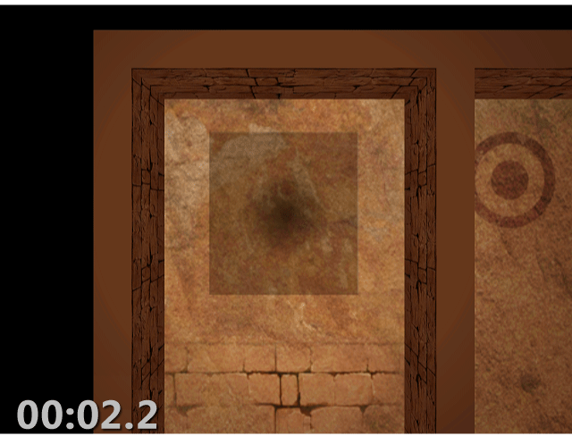
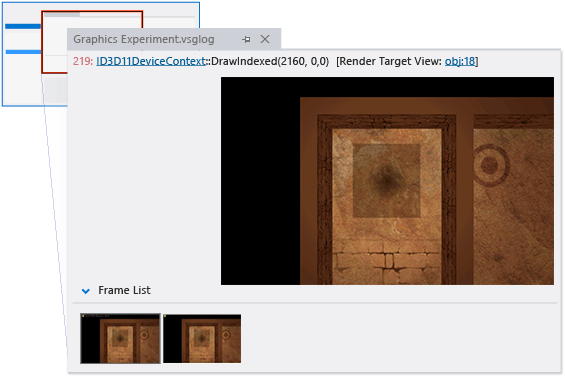
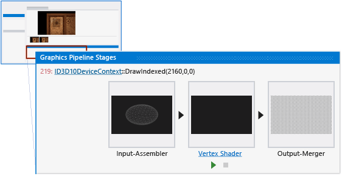
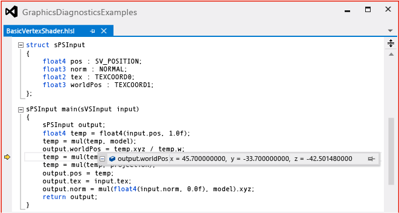
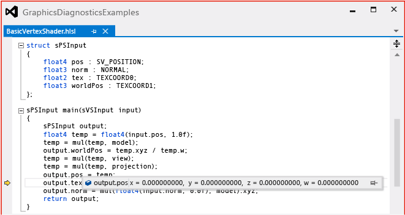
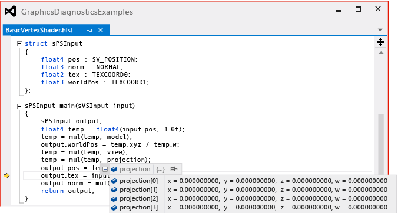
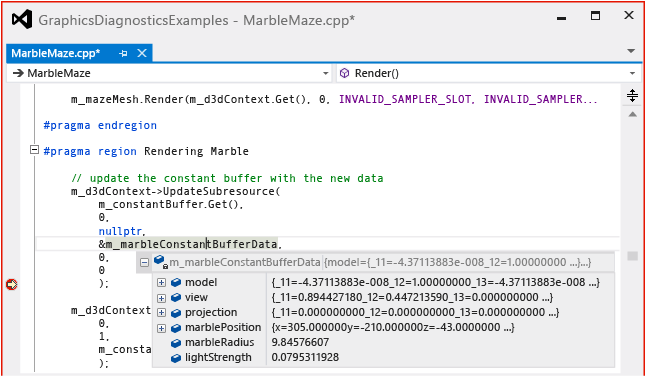
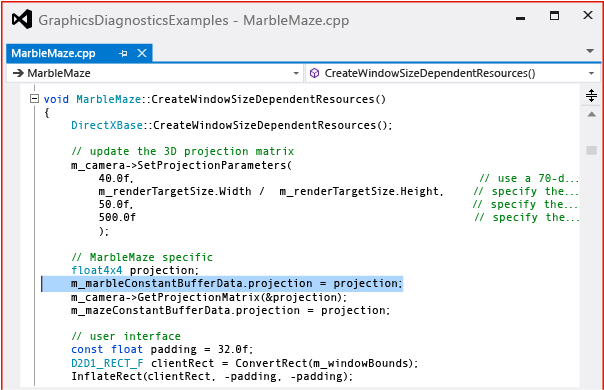
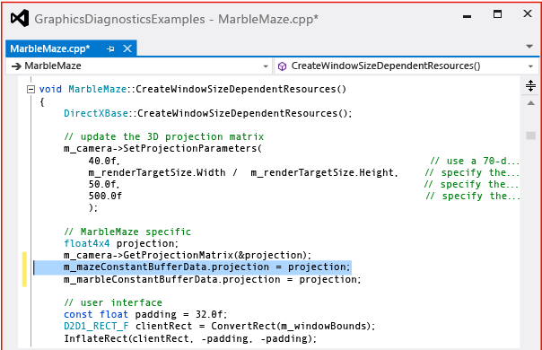
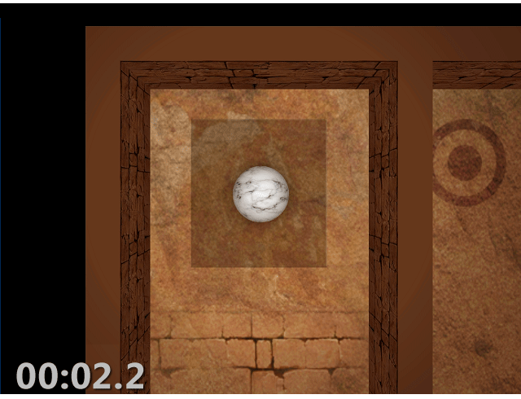

# Walkthrough: Missing Objects Due to Vertex Shading
This walkthrough demonstrates how to use the [!INCLUDE[vsprvs](../vs140/includes/vsprvs_md.md)] Graphics Diagnostics tools to investigate an object that is missing due to an error that occurs during the vertex shader stage.  
  
 This walkthrough illustrates these tasks:  
  
-   Using the **Graphics Event List** to locate potential sources of the problem.  
  
-   Using the **Graphics Pipeline Stages** window to check the effect of the `DrawIndexed` Direct3D API calls.  
  
-   Using the **HLSL Debugger** to examine the vertex shader.  
  
-   Using the **Graphics Event Call Stack** to help find the source of an incorrect HLSL constant.  
  
## Scenario  
 One of the common causes of a missing object in a 3-D app occurs when the vertex shader transforms the object's vertices in an incorrect or unexpected way—for example, the object might be scaled to a very small size, or transformed such that it appears behind the camera, rather than in front of it.  
  
 In this scenario, when the app is run to test it, the background is rendered as expected, but one of the objects does not appear. By using Graphics Diagnostics, you capture the problem to a graphics log so that you can debug the app. The problem looks like this in the app:  
  
   
  
## Investigation  
 By using the Graphics Diagnostics tools, you can load the graphics log file to inspect the frames that were captured during the test.  
  
#### To examine a frame in a graphics log  
  
1.  In [!INCLUDE[vsprvs](../vs140/includes/vsprvs_md.md)], load a graphics log that contains a frame that exhibits the missing object. A new graphics log tab appears in [!INCLUDE[vsprvs](../vs140/includes/vsprvs_md.md)]. In the top part of this tab is the render target output of the selected frame. In the bottom part is the **Frame List**, which displays each captured frame as a thumbnail image.  
  
2.  In the **Frame List**, select a frame that demonstrates that the object is not displayed. The render target is updated to reflect the selected frame. In this scenario, the graphics log tab looks like this:  
  
       
  
 After you've selected a frame that demonstrates the problem, you can begin to diagnose it by using the **Graphics Event List**. The **Graphics Event List** contains every Direct3D API call that was made to render the active frame, for example, API calls to set up device state, to create and update buffers, and to draw objects that appear in the frame. Many kinds of calls are interesting because there is often (but not always) a corresponding change in the render target when the app is working as expected, for example Draw, Dispatch, Copy or Clear calls. Draw calls are particularly interesting because each one represents geometry that the app rendered (Dispatch calls can also render geometry).  
  
 Because you know that the missing object is not being drawn to the render target (in this case)—but that the rest of the scene is drawn as expected—you can use the **Graphics Event List** together with the **Graphics Pipeline Stages** tool to determine which draw call corresponds to the missing object's geometry. The **Graphics Pipeline Stages** window shows the geometry that was sent to each draw call, regardless of its effect on the render target. As you move through the draw calls, the pipeline stages are updated to show the geometry that is associated with that call, and the render target output is updated to show the state of the render target after the call was completed.  
  
#### To find the draw call for the missing geometry  
  
1.  Open the **Graphics Event List** window. On the **Graphics Diagnostics** toolbar, choose **Event List**.  
  
2.  Open the **Graphics Pipeline Stages** window. On the **Graphics Diagnostics** toolbar, choose **Pipeline Stages**.  
  
3.  As you move through each draw call in the **Graphics Event List** window, watch the **Graphics Pipeline Stages** window for the missing object. To make this easier, enter "Draw" in the **Search** box in the upper-right corner of the **Graphics Event List** window. This filters the list so that it only contains events that have "Draw" in their titles.  
  
     In the **Graphics Pipeline Stages** window, the **Input Assembler** stage shows the object's geometry before its transformed, and the **Vertex Shader** stage shows the same object after it's transformed. In this scenario, you know that you've found the missing object when it is displayed in the **Input Assembler** stage and nothing is displayed in the **Vertex Shader** stage.  
  
    > [!NOTE]
    >  If other geometry stages—for example, the Hull Shader, Domain Shader, or Geometry Shader stages—process the object, they might be the cause of the problem. Typically, the problem is related to the earliest stage in which the result is not displayed or is displayed in an unexpected way.  
  
4.  Stop when you reach the draw call that corresponds to the missing object. In this scenario, the **Graphics Pipeline Stages** window indicates that the geometry was issued to the GPU (indicated by the Input Assembler thumbnail), but doesn't appear in the render target because something went wrong during the vertex shader stage (indicated by the Vertex Shader thumbnail):  
  
       
  
 After you confirm that the app issued a draw call for the missing object's geometry and discover that the problem happens during the vertex shader stage, you can use the HLSL Debugger to examine the vertex shader and find out what happened to the object's geometry. You can use the HLSL Debugger to examine the state of HLSL variables during execution, step through the HLSL code, and set breakpoints to help you diagnose the problem.  
  
#### To examine the vertex shader  
  
1.  Start debugging the vertex shader stage. In the **Graphics Pipeline Stages** window, under the **Vertex Shader** stage, choose the **Start Debugging** button.  
  
2.  Because the **Input Assembler** stage appears to provide good data to the vertex shader and the **Vertex Shader** stage appears to produce no output, you want to examine the vertex shader output structure, `output`. As you step through the HLSL code, you take a closer look when `output` is modified.  
  
3.  The first time that `output` is modified, the member `worldPos` is written to.  
  
       
  
     Because its value appears to be reasonable, you continue stepping through code until the next line that modifies `output`.  
  
4.  The next time that `output` is modified, the member `pos` is written to.  
  
       
  
     This time, the value of the `pos` member—all zeros—seems suspicious. Next, you want to determine how `output.pos` came to have a value of all zeros.  
  
5.  You notice that `output.pos` takes its value from a variable that's named `temp`. On the previous line, you see that the value of `temp` is the result of multiplying its previous value by a constant that's named `projection`. You suspect that `temp`'s suspicious value is the result of this multiplication. When you rest the pointer on `projection`, you notice that its value is also all zeros.  
  
       
  
     In this scenario, the examination reveals that `temp`'s suspicious value is most likely caused by its multiplication by `projection`, and because `projection` is a constant that's meant to contain a projection matrix, you know that it should not contain all zeros.  
  
 After you determine that the HLSL constant `projection`—passed into the shader by your app—is the likely source of the problem, the next step is to find the location in your app's source code where the constant buffer is filled. You can use the **Graphics Event Call Stack** to find this location.  
  
#### To find where the constant is set in your app's source code  
  
1.  Open the **Graphics Event Call Stack** window. On the **Graphics Diagnostics** toolbar, choose **Graphics Event Call Stack**.  
  
2.  Navigate up the call stack into your app's source code. In the **Graphics Event Call Stack** window, choose the top-most call to see if the constant buffer is being filled there. If it is not, continue up the call stack until you find where it is being filled. In this scenario, you discover that the constant buffer is being filled—by using the `UpdateSubresource` Direct3D API—further up the call stack in a function that's named `MarbleMaze::Render`, and that its value comes from a constant buffer object that's named `m_marbleConstantBufferData`:  
  
       
  
    > [!TIP]
    >  If you are simultaneously debugging your app, you can set a breakpoint at this location and it will be hit when the next frame is rendered. You can then inspect the members of `m_marbleConstantBufferData` to confirm that the value of the `projection` member is set to all zeros when the constant buffer is filled.  
  
 After you find the location where the constant buffer is being filled and discover that that its values come from the variable `m_marbleConstantBufferData`, the next step is to find out where the `m_marbleConstantBufferData.projection` member is set to all zeros. You can use **Find All References** to quickly scan for code that changes the value of `m_marbleConstantBufferData.projection`.  
  
#### To find where the projection member is set in your app's source code  
  
1.  Find references to `m_marbleConstantBufferData.projection`. Open the shortcut menu for the variable `m_marbleConstantBufferData`, and then choose **Find All References**.  
  
2.  To navigate to the location of the line in your app's source code where the `projection` member is modified, choose that line in the **Find Symbol Results** window. Because the first result that modifies the projection member might not be the cause of the problem, you might have to examine several areas of your app's source code.  
  
 After you find the location where `m_marbleConstantBufferData.projection` is set, you can examine the surrounding source code to determine the origin of the incorrect value. In this scenario, you discover that the value of `m_marbleConstantBufferData.projection` is set to a local variable that's named `projection` before it has been initialized to a value that's given by the code `m_camera->GetProjection(&projection);` on the next line.  
  
   
  
 To fix the problem, you move the line of code that sets the value of `m_marbleConstantBufferData.projection` after the line that initializes the value of the local variable `projection`.  
  
   
  
 After you fix the code, you can rebuild it and run the app again to discover that the rendering issue is solved:  
  
 