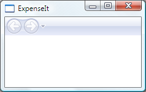
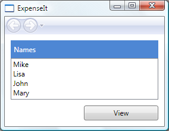
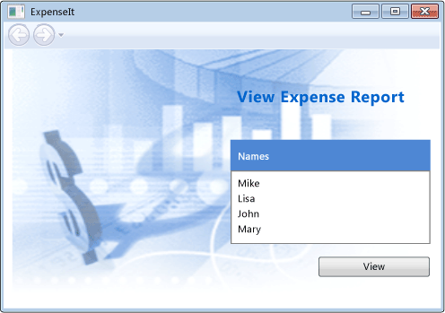
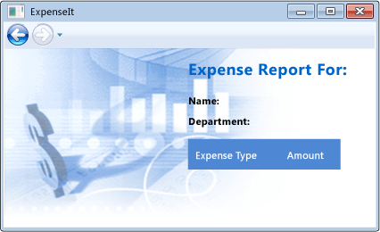
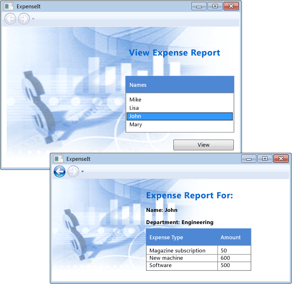

# Walkthrough: My First WPF Desktop Application
\<a name="introduction">\</a> This walkthrough provides an introduction to Windows Presentation Foundation (WPF) development. You’ll create a basic application that includes the elements that are common to most WPF desktop applications: XAML markup, code-behind, application definitions, controls, layout, data binding, and styles.  
  
##  \<a name="Create_The_Application_Code_Files">\</a> Creating the Application Project  
 In this section, you’ll create the application infrastructure, which includes the project and a main window or form.  
  
#### To create the project  
  
1.  On the menu bar, choose **File**, **New**, **Project**.  
  
2.  In the **New Project** dialog, expand either the **Visual C#** or **Visual Basic** node and choose the **Windows** node, and then expand the **Windows** node and choose the **Classic Desktop** node.  
  
3.  In the template list, choose the **WPF Application** template.  
  
4.  In the **Name** textbox enter <CodeContentPlaceHolder>33\</CodeContentPlaceHolder>, and then choose the **OK** button.  
  
     The project is created and the project files are added to **Solution Explorer**, and the designer for the default application window named **MainWindow.xaml** is displayed.  
  
#### To modify the main window  
  
1.  In the designer, choose the **MainWindow.xaml** tab if it isn’t already the active designer tab.  
  
2.  If you’re using C#, find the line <CodeContentPlaceHolder>34\</CodeContentPlaceHolder> and replace it with <CodeContentPlaceHolder>35\</CodeContentPlaceHolder>.  
  
     If you’re using Visual Basic, find the line <CodeContentPlaceHolder>36\</CodeContentPlaceHolder> and replace it with <CodeContentPlaceHolder>37\</CodeContentPlaceHolder>.  
  
     Notice that when you change the <CodeContentPlaceHolder>38\</CodeContentPlaceHolder> tag to <CodeContentPlaceHolder>39\</CodeContentPlaceHolder>, Intellisense automatically changes the closing tag to <CodeContentPlaceHolder>40\</CodeContentPlaceHolder> as well.  
  
    > [!NOTE]
    >  After changing the tag, if the **Error List** window is open you may notice several errors. Don’t worry, the changes you make in the next few steps will make these go away.  
  
3.  Choose the <CodeContentPlaceHolder>41\</CodeContentPlaceHolder> and <CodeContentPlaceHolder>42\</CodeContentPlaceHolder> tags and delete them.  
  
     A **NavigationWindow** can’t contain other UI elements such as a **Grid**.  
  
4.  In the **Properties** window, expand the **Common** category node and choose the **Title** property, and then enter <CodeContentPlaceHolder>43\</CodeContentPlaceHolder> and press the **Enter** key.  
  
     Notice that the **Title** element in the XAML window changes to match the new value. You can modify XAML properties in either the XAML window or the **Properties** window, and the changes are synchronized.  
  
5.  In the XAML window, set the value of the **Height** element to <CodeContentPlaceHolder>44\</CodeContentPlaceHolder>, and set the value of the **Width** property to <CodeContentPlaceHolder>45\</CodeContentPlaceHolder>.  
  
     These elements correspond to the **Height** and **Width** properties, found in the **Layout** category in the **Properties** window.  
  
     Your **MainWindow.xaml** file should now look like this in C#:  
  
<CodeContentPlaceHolder>0\</CodeContentPlaceHolder>  
     Or like this in Visual Basic:  
  
<CodeContentPlaceHolder>1\</CodeContentPlaceHolder>  
#### To modify the code-behind file (C#)  
  
1.  In **Solution Explorer**, expand the **MainWindow.xaml** node and open the **MainWindow.xaml.cs** file.  
  
2.  Find the line <CodeContentPlaceHolder>46\</CodeContentPlaceHolder> and replace it with <CodeContentPlaceHolder>47\</CodeContentPlaceHolder>.  
  
     This changes the <CodeContentPlaceHolder>48\</CodeContentPlaceHolder> class to derive from <CodeContentPlaceHolder>49\</CodeContentPlaceHolder>. In Visual Basic, this happens automatically when you change the window in XAML, so no code changes are necessary.  
  
##  \<a name="add_files_to_the_application">\</a> Adding Files to the Application  
 In this section, you’ll add two pages and an image to the application.  
  
#### To add a home screen  
  
1.  In **Solution Explorer**, open the shortcut menu for the **ExpenseIt** node and choose **Add**, **Page**.  
  
2.  In the **Add New Item** dialog, choose the **Name** text box and enter <CodeContentPlaceHolder>50\</CodeContentPlaceHolder>, and then choose the **Add** button.  
  
     This page is the first window that is displayed when the application is launched.  
  
3.  In the designer, choose the **ExpenseItHome.xaml** tab if it isn’t already the active designer tab.  
  
4.  Choose the <CodeContentPlaceHolder>51\</CodeContentPlaceHolder> element and change the title to **ExpenseIt – Home**.  
  
     Your **ExpenseItHome.xaml** file should now look like this in C#:  
  
<CodeContentPlaceHolder>2\</CodeContentPlaceHolder>  
     Or like this in Visual Basic:  
  
<CodeContentPlaceHolder>3\</CodeContentPlaceHolder>  
5.  In the designer, choose the **MainWindow.xaml** tab.  
  
6.  Find the line <CodeContentPlaceHolder>52\</CodeContentPlaceHolder> element and add a <CodeContentPlaceHolder>53\</CodeContentPlaceHolder> property.  
  
     This sets **ExpenseItHome.xaml** to be the first page opened when the application starts. Your **MainWindow.xaml** file should now look like this in C#:  
  
<CodeContentPlaceHolder>4\</CodeContentPlaceHolder>  
     Or like this in Visual Basic:  
  
<CodeContentPlaceHolder>5\</CodeContentPlaceHolder>  
     As with the properties that you set earlier, you could have set the <CodeContentPlaceHolder>54\</CodeContentPlaceHolder> property in the **Miscellaneous** category of the **Properties** window.  
  
#### To add a details window  
  
1.  In **Solution Explorer**, open the shortcut menu for the **ExpenseIt** node and choose **Add**, **Page**.  
  
2.  In the **Add New Item** dialog, choose the **Name** text box and enter <CodeContentPlaceHolder>55\</CodeContentPlaceHolder>, and then choose the **Add** button.  
  
     This window will display an individual expense report.  
  
3.  In the designer, choose the **ExpenseReportPage.xaml** tab if it isn’t already the active designer tab.  
  
4.  Choose the <CodeContentPlaceHolder>56\</CodeContentPlaceHolder> element and change the title to **ExpenseIt – View Expense**.  
  
     Your ExpenseReportPage.xaml file should now look like this in C#:  
  
<CodeContentPlaceHolder>6\</CodeContentPlaceHolder>  
     Or like this in Visual Basic:  
  
<CodeContentPlaceHolder>7\</CodeContentPlaceHolder>  
5.  On the menu bar, choose **Debug**, **Start Debugging** (or press F5) to run the application.  
  
     The following illustration shows the application with the navigation window buttons.  
  
       
  
6.  Close the application to return to design mode.  
  
##  \<a name="Add_Layout">\</a> Creating the User Interface  
 Layout provides an ordered way to place elements, and also manages the size and position of those elements when a form is resized. In this section, you’ll create a single-column grid with three rows. You’ll add controls to the two pages, add some code, and finally define reusable styles for the controls.  
  
#### To create the layout  
  
1.  Open **ExpenseItHome.xaml** and choose the <CodeContentPlaceHolder>57\</CodeContentPlaceHolder> element.  
  
2.  In the **Properties** window, expand the **Layout** category node and set the **Margin** values to <CodeContentPlaceHolder>58\</CodeContentPlaceHolder>, <CodeContentPlaceHolder>59\</CodeContentPlaceHolder>, <CodeContentPlaceHolder>60\</CodeContentPlaceHolder>, and <CodeContentPlaceHolder>61\</CodeContentPlaceHolder>, which corresponds to left, right, top and bottom margins.  
  
     The element <CodeContentPlaceHolder>62\</CodeContentPlaceHolder> is added to the <CodeContentPlaceHolder>63\</CodeContentPlaceHolder> element in the XAML. Once again, you could have entered these values directly in the XAML code instead of in the **Properties** window with the same result.  
  
3.  Add the following XAML code to the <CodeContentPlaceHolder>64\</CodeContentPlaceHolder> element to create the row and column definitions:  
  
<CodeContentPlaceHolder>8\</CodeContentPlaceHolder>  
#### To add controls  
  
1.  Open **ExpenseItHome.xaml**.  
  
2.  Add the following XAML code just above the <CodeContentPlaceHolder>65\</CodeContentPlaceHolder> tag to create the <CodeContentPlaceHolder>66\</CodeContentPlaceHolder>, <CodeContentPlaceHolder>67\</CodeContentPlaceHolder> and <CodeContentPlaceHolder>68\</CodeContentPlaceHolder> controls.  
  
<CodeContentPlaceHolder>9\</CodeContentPlaceHolder>  
     Notice that the controls appear in the design window. You could also have created the controls by dragging them from the **Toolbox** window onto the design window and setting their properties in the **Properties** window.  
  
3.  Build and run the application. The following illustration shows the run time appearance of the controls that are created by the XAML in this procedure.  
  
       
  
4.  Close the application to return to design mode.  
  
#### To add a background image  
  
1.  Choose the following image and save it as <CodeContentPlaceHolder>69\</CodeContentPlaceHolder>.  
  
       
  
    > [!NOTE]
    >  Alternatively you can create your own image and save it as <CodeContentPlaceHolder>70\</CodeContentPlaceHolder>.  
  
2.  In **Solution Explorer**, open the shortcut menu for the **ExpenseIt** node and choose **Add**, **Existing Item**.  
  
3.  In the **Add Existing Item** dialog, find the **watermark.png** image that you just added, choose it and then choose the **Add** button.  
  
    > [!NOTE]
    >  You may need to expand the **File Types** list and choose **Image Files**.  
  
4.  Open the **ExpenseItHome.xaml** file and add the following XAML code just above the <CodeContentPlaceHolder>71\</CodeContentPlaceHolder> tag to create a background image:  
  
<CodeContentPlaceHolder>10\</CodeContentPlaceHolder>  
#### To add a title  
  
1.  Open **ExpenseItHome.xaml**.  
  
2.  Find the line <CodeContentPlaceHolder>72\</CodeContentPlaceHolder> and add the following just below it:  
  
<CodeContentPlaceHolder>11\</CodeContentPlaceHolder>  
     This creates an additional column to the left of the other columns with a fixed width of 230 pixels.  
  
3.  Find the line <CodeContentPlaceHolder>73\</CodeContentPlaceHolder> and add the following just below it:  
  
<CodeContentPlaceHolder>12\</CodeContentPlaceHolder>  
     This adds a row to the top of the grid.  
  
4.  Move the controls to the second column by setting the <CodeContentPlaceHolder>74\</CodeContentPlaceHolder> value to 1. Move each control down a row, by increasing each <CodeContentPlaceHolder>75\</CodeContentPlaceHolder> value by 1.  
  
    1.  Find the line <CodeContentPlaceHolder>76\</CodeContentPlaceHolder>. Change <CodeContentPlaceHolder>77\</CodeContentPlaceHolder> to <CodeContentPlaceHolder>78\</CodeContentPlaceHolder> and change <CodeContentPlaceHolder>79\</CodeContentPlaceHolder> to <CodeContentPlaceHolder>80\</CodeContentPlaceHolder>.  
  
    2.  Find the line <CodeContentPlaceHolder>81\</CodeContentPlaceHolder>. Change <CodeContentPlaceHolder>82\</CodeContentPlaceHolder> to <CodeContentPlaceHolder>83\</CodeContentPlaceHolder> and change <CodeContentPlaceHolder>84\</CodeContentPlaceHolder> to <CodeContentPlaceHolder>85\</CodeContentPlaceHolder>.  
  
    3.  Find the line <CodeContentPlaceHolder>86\</CodeContentPlaceHolder>. Change <CodeContentPlaceHolder>87\</CodeContentPlaceHolder> to <CodeContentPlaceHolder>88\</CodeContentPlaceHolder> and change <CodeContentPlaceHolder>89\</CodeContentPlaceHolder> to <CodeContentPlaceHolder>90\</CodeContentPlaceHolder>.  
  
5.  Just before the <CodeContentPlaceHolder>91\</CodeContentPlaceHolder> element add the following XAML code to display the title:  
  
<CodeContentPlaceHolder>13\</CodeContentPlaceHolder>  
     The contents of **ExpenseItHome.xaml** should now look like this in C#:  
  
<CodeContentPlaceHolder>14\</CodeContentPlaceHolder>  
     Or like this in Visual Basic:  
  
<CodeContentPlaceHolder>15\</CodeContentPlaceHolder>  
6.  If you build and run the application at this point, it should look like the following illustration:  
  
       
  
#### To add code to the button  
  
1.  Open **ExpenseItHome.xaml**.  
  
2.  Chose the <CodeContentPlaceHolder>92\</CodeContentPlaceHolder> element and add the following XAML code immediately after the **HorizontalAlignment="Right"** element: <CodeContentPlaceHolder>93\</CodeContentPlaceHolder>.  
  
     This adds an event handler for the button’s <CodeContentPlaceHolder>94\</CodeContentPlaceHolder> event. The **<Button** element code should now look like this:  
  
<CodeContentPlaceHolder>16\</CodeContentPlaceHolder>  
3.  Open the **ExpenseItHome.xaml.cs** or **ExpenseItHome.xaml.vb** file.  
  
4.  Add the following code to the <CodeContentPlaceHolder>95\</CodeContentPlaceHolder> class:  
  
<CodeContentPlaceHolder>17\</CodeContentPlaceHolder>  
<CodeContentPlaceHolder>18\</CodeContentPlaceHolder>  
     This event handler opens the Expense Report Page when the button is clicked.  
  
#### To create the UI for the report page  
  
1.  Open **ExpenseReportPage.xaml**.  
  
     This page will display the expense report for the person that is selected on the Home page.  
  
2.  Add the following XAML code between the <CodeContentPlaceHolder>96\</CodeContentPlaceHolder> and <CodeContentPlaceHolder>97\</CodeContentPlaceHolder> tags:  
  
<CodeContentPlaceHolder>19\</CodeContentPlaceHolder>  
     This UI is similar to the UI created for the home page, but the report data is displayed in a **DataGrid** control.  
  
3.  Build and run the application.  
  
4.  Choose the **View** button.  
  
     The expense report page appears.  
  
     The following illustration shows the Expense Report Page. Notice that the back navigation button is enabled.  
  
       
  
#### To style controls  
  
1.  Open the **App.xaml** file (C#) or **Application.xaml** file (Visual Basic).  
  
2.  Add the following XAML between the <CodeContentPlaceHolder>98\</CodeContentPlaceHolder> and <CodeContentPlaceHolder>99\</CodeContentPlaceHolder> tags:  
  
<CodeContentPlaceHolder>20\</CodeContentPlaceHolder>  
     This XAML adds the following styles:  
  
    -   <CodeContentPlaceHolder>100\</CodeContentPlaceHolder>: To format the page title <CodeContentPlaceHolder>101\</CodeContentPlaceHolder>.  
  
    -   <CodeContentPlaceHolder>102\</CodeContentPlaceHolder>: To format the <CodeContentPlaceHolder>103\</CodeContentPlaceHolder> controls.  
  
    -   <CodeContentPlaceHolder>104\</CodeContentPlaceHolder>: To format the <CodeContentPlaceHolder>105\</CodeContentPlaceHolder>.  
  
    -   <CodeContentPlaceHolder>106\</CodeContentPlaceHolder>: To format the list header <CodeContentPlaceHolder>107\</CodeContentPlaceHolder> controls.  
  
    -   <CodeContentPlaceHolder>108\</CodeContentPlaceHolder>: To format the list header **Label**.  
  
    -   <CodeContentPlaceHolder>109\</CodeContentPlaceHolder>: To format the <CodeContentPlaceHolder>110\</CodeContentPlaceHolder> on the **ExpenseItHome.xaml** pppage.  
  
3.  Open **ExpenseItHome.xaml** and replace everything between the <CodeContentPlaceHolder>111\</CodeContentPlaceHolder> and <CodeContentPlaceHolder>112\</CodeContentPlaceHolder> elements with the following XAML  
  
<CodeContentPlaceHolder>21\</CodeContentPlaceHolder>  
     The properties such as <CodeContentPlaceHolder>113\</CodeContentPlaceHolder> and <CodeContentPlaceHolder>114\</CodeContentPlaceHolder> that define the look of each control are removed and replaced by applying the styles.  
  
4.  Open **ExpenseReportPage.xaml** and replace everything between the <CodeContentPlaceHolder>115\</CodeContentPlaceHolder> and final <CodeContentPlaceHolder>116\</CodeContentPlaceHolder> elements with the following XAML  
  
<CodeContentPlaceHolder>22\</CodeContentPlaceHolder>  
     This adds styles to the <CodeContentPlaceHolder>117\</CodeContentPlaceHolder> and <CodeContentPlaceHolder>118\</CodeContentPlaceHolder> elements.  
  
## Connecting to Data  
 In this section, you’ll create a data provider and a data template, and then connect the controls to display the data.  
  
#### To bind data to a control  
  
1.  Open **ExpenseItHome.xaml** and choose the <CodeContentPlaceHolder>119\</CodeContentPlaceHolder> element..  
  
2.  Add the following XAML code:  
  
<CodeContentPlaceHolder>23\</CodeContentPlaceHolder>  
     This code creates an <CodeContentPlaceHolder>120\</CodeContentPlaceHolder> class that contains the data for each person. Normally this would be loaded as a file, but for simplicity the data is added inline.  
  
3.  Inside the <CodeContentPlaceHolder>121\</CodeContentPlaceHolder> element, add the following XAML code:  
  
<CodeContentPlaceHolder>24\</CodeContentPlaceHolder>  
     This adds a <CodeContentPlaceHolder>122\</CodeContentPlaceHolder> which defines how to display the data in the **ListBox**.  
  
4.  Replace the existing <CodeContentPlaceHolder>123\</CodeContentPlaceHolder> element with the following XAML.  
  
<CodeContentPlaceHolder>25\</CodeContentPlaceHolder>  
     This code binds the <CodeContentPlaceHolder>124\</CodeContentPlaceHolder> property of the <CodeContentPlaceHolder>125\</CodeContentPlaceHolder> to the data source and applies the data template as the <CodeContentPlaceHolder>126\</CodeContentPlaceHolder>.  
  
#### To connect data to controls  
  
1.  Open **ExpenseReportPage.xaml.vb** or **ExpenseReportPage.xaml.cs**.  
  
2.  In C#, add the following constructor to the **ExpenseReportPage** class, or in Visual Basic replace the existing class with the following:  
  
<CodeContentPlaceHolder>26\</CodeContentPlaceHolder>  
<CodeContentPlaceHolder>27\</CodeContentPlaceHolder>  
     This constructor takes a data object as a parameter. In this case the data object will contain the name of the selected person.  
  
3.  Open **ExpenseItHome.xaml.vb** or **ExpenseItHome.xaml.cs**.  
  
4.  Replace the <CodeContentPlaceHolder>127\</CodeContentPlaceHolder> event handler code with the following:  
  
<CodeContentPlaceHolder>28\</CodeContentPlaceHolder>  
<CodeContentPlaceHolder>29\</CodeContentPlaceHolder>  
     This code calls the new constructor.  
  
#### To update the UI with data templates  
  
1.  Open **ExpenseReportPage.xaml**.  
  
2.  Replace the XAML code for the **Name** and **Department**<CodeContentPlaceHolder>128\</CodeContentPlaceHolder> elements with the following:  
  
<CodeContentPlaceHolder>30\</CodeContentPlaceHolder>  
     This binds the **Label** controls to the appropriate data source properties.  
  
3.  Add the following XAML code inside the <CodeContentPlaceHolder>129\</CodeContentPlaceHolder> element:  
  
<CodeContentPlaceHolder>31\</CodeContentPlaceHolder>  
     This defines how to display the expense report data.  
  
4.  Replace the <CodeContentPlaceHolder>130\</CodeContentPlaceHolder> element with the following:  
  
<CodeContentPlaceHolder>32\</CodeContentPlaceHolder>  
     This adds an **ItemSource** and defines the bindings for the expense items.  
  
5.  Build and run the application.  
  
6.  Choose a person and then choose the **View** button.  
  
     The following illustration shows both pages of the ExpenseIt application with controls, layout, styles, data binding, and data templates applied.  
  
       
  
##  \<a name="Best_Practices">\</a> Best Practices  
 This sample demonstrates the basics of WPF and, consequently, does not follow application development best practices. For comprehensive coverage of WPF and .NET Framework application development best practices, see the following topics as appropriate:  
  
-   Accessibility - [Accessibility Best Practices](https://msdn.microsoft.com/en-us/library/aa350483\(v=vs.100\).aspx)  
  
-   Security - [Windows Presentation Foundation Security](https://msdn.microsoft.com/en-us/library/aa970906\(v=vs.100\).aspx)  
  
-   Localization - [WPF Globalization and Localization Overview](https://msdn.microsoft.com/en-us/library/ms788718\(v=vs.100\).aspx)  
  
-   Performance - [Optimizing WPF Application Performance](https://msdn.microsoft.com/en-us/library/aa970683\(v=vs.100\).aspx)  
  
##  \<a name="Whats_Next">\</a> What's Next  
 You now have a number of techniques at your disposal for creating a desktop application by using WPF. You should now have a basic understanding of the building blocks of a data-bound WPF application. This topic is by no means exhaustive, but hopefully you also now have a sense of some of the possibilities you might discover on your own beyond the techniques in this topic.  
  
 For more information about the WPF architecture and programming models, see the following topics:  
  
-   [WPF Architecture](https://msdn.microsoft.com/en-us/library/ms750441\(v=vs.100\).aspx)  
  
-   [XAML Overview](https://msdn.microsoft.com/en-us/library/ms752059\(v=vs.100\).aspx)  
  
-   [Dependency Properties Overview](https://msdn.microsoft.com/en-us/library/ms752914\(v=vs.100\).aspx)  
  
-   [Layout System](https://msdn.microsoft.com/en-us/library/ms745058\(v=vs.100\).aspx)  
  
-   [Styles and Templates](https://msdn.microsoft.com/en-us/library/bb613570\(v=vs.100\).aspx)  
  
 For more information about creating applications, see the following topics:  
  
-   [Application Development Overview](https://msdn.microsoft.com/en-us/library/bb613549\(v=vs.100\).aspx)  
  
-   [Controls Overview](https://msdn.microsoft.com/en-us/library/bb613551\(v=vs.100\).aspx)  
  
-   [Data Binding Overview](https://msdn.microsoft.com/en-us/library/ms752347\(v=vs.100\).aspx)  
  
-   [WPF Graphics, Animation, and Media Overview](https://msdn.microsoft.com/en-us/library/ms742562\(v=vs.100\).aspx)  
  
-   [Documents in WPF](https://msdn.microsoft.com/en-us/library/ms748388\(v=vs.100\).aspx)  
  
## See Also  
 [Walkthrough: Create a WPF Desktop Application connected to an Azure Mobile Services](../vs140/walkthrough--create-a-wpf-desktop-application-connected-to-an-azure-mobile-service.md)   
 [Create Modern Desktop Applications with Windows Presentation Foundation](../vs140/create-modern-desktop-applications-with-windows-presentation-foundation.md)