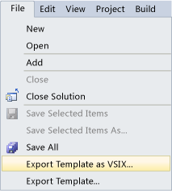
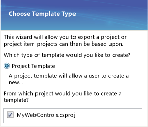
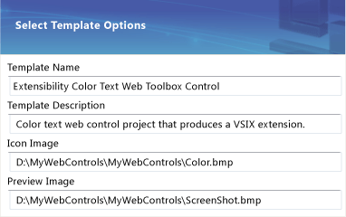
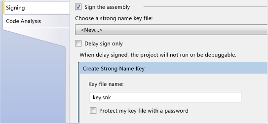

# Walkthrough: Publishing a Web Control Project Template
You can create a web control project template to use as the basis for other web control projects. You can also distribute the template as a VSIX extension.  
  
 To distribute a VSIX extension, we recommend that you add it to the Visual Studio Gallery website because developers can use Extension Manager to browse there for new and updated extensions. You can also distribute an extension by putting it on a different server, or by burning it on a CD or other media.  
  
 This walkthrough, which is one of two related walkthroughs, teaches how to create a web control project template and then distribute it. The other walkthrough, [Walkthrough: Publishing a Custom Web Control](../vs140/walkthrough--publishing-a-visual-studio-extension.md), teaches how to create and distribute a web control.  
  
 This walkthrough contains these sections:  
  
-   Creating a Web Control Project Template in a VSIX Extension  
  
-   Publishing the Template to the Visual Studio Gallery  
  
-   Installing the Template from the Visual Studio Gallery  
  
-   Testing the Installed Template  
  
-   Adding a Debug Action Wizard to the Template  
  
## Prerequisites  
 To complete this walkthrough, you must understand web controls and know how to create projects, set project properties, and use the Visual Studio experimental instance. Both Visual Studio and the Visual Studio SDK must be installed on the computer. Before you start this walkthrough, you must complete [Walkthrough: Publishing a Custom Web Control](../vs140/walkthrough--publishing-a-visual-studio-extension.md).  
  
## Creating a Web Control Project Template in a VSIX Extension  
 To create a web control project template, first create a web control project. For this walkthrough, start with the ColorTextControl web control project that you created in [Walkthrough: Publishing a Custom Web Control](../vs140/walkthrough--publishing-a-visual-studio-extension.md).  
  
 Before you publish a project template to the Visual Studio Gallery, use the **Export Template as VSIX** wizard to export the template as a VSIX extension and give it an icon to help identify it in **Extension Manager** and an image to illustrate what it does.  
  
#### To prepare a web control project for distribution  
  
1.  In Visual Studio, open the MyWebControls project.  
  
2.  Use **Extension Manager** to download the **Export Template Wizard** from the [Visual Studio Gallery](http://go.microsoft.com/fwlink/?LinkId=194329) website.  
  
     After the wizard is installed, when a project is open, **Export Template as VSIX** appears on the **File** menu.  
  
3.  On the **File** menu, click **Export Template as VSIX**.  
  
       
  
4.  On the **Choose Template Type** page, select **Project Template** and then select MyWebControls.csproj. Click **Next**.  
  
       
  
5.  On the **Select Template Options** page, set **Template Name** to `Extensibility Color Text Web Toolbox Control` and **Template Description** to `Color text web control project that produces a VSIX extension.`  
  
6.  Next to the **Icon Image** box, click **Browse**. In the **File name** box, type `*.*`. Locate Color.bmp and click **Open**.  
  
7.  Next to the **Preview Image** box, click **Browse**. In the **File name** box, type `*.*`. Locate ScreenShot.bmp and click **Open**. Click **Next**.  
  
       
  
8.  On the **Select VSIX Options** page, change **Product Name** to `Extensibility Color Text Web Control Template`.  
  
9. If you want to, you can change **Company Name**, **Version**, **License**, and **Getting started guide URL**.  
  
10. Clear the **Automatically import the template into Visual Studio** option. Click **Finish**.  
  
       
  
     In Windows Explorer, in the ..\My Documents\Visual Studio *\<version>*\My Exported Templates\ folder, Extensibility Color Text Web Control Template.vsix is listed.  
  
## Publishing the Template to the Visual Studio Gallery  
 The project template is now ready to be published to the Visual Studio Gallery.  
  
#### To publish the template to the Visual Studio Gallery  
  
1.  In a web browser, open the [Visual Studio Gallery](http://go.microsoft.com/fwlink/?LinkId=194329) website.  
  
2.  In the upper-right corner, click **sign in**.  
  
3.  Use your Microsoft account to sign in. If you do not have a Microsoft account, you can create one here.  
  
4.  Click **Upload**.  
  
5.  In **Step 1: Extension Type**, select **Project or Item Template** and then click **Next**.  
  
6.  In **Step 2: Upload**, click **Browse**. In the \My Exported Templates\ folder, select Extensibility Color Text Web Control Template.vsix. Click **Next**.  
  
7.  In **Step 3: Basic Information**, information from the **Export Template as VSIX Wizard** is displayed.  
  
8.  Set **Category** to `ASP.NET` and **Tags** to `toolbox, web control, templates`.  
  
9. Read the Contribution Agreement and agree to it, and then in the box, type the text that is displayed.  
  
10. Click **Create Contribution**, and then click **Publish**.  
  
11. Search the Visual Studio Gallery for Extensibility Color Text Web Control Template. The listing for the template should appear.  
  
       
  
## Installing the Template from the Visual Studio Gallery  
 Now that the web control project template is published, install it in Visual Studio and test it there.  
  
#### To install the web control project template in Visual Studio  
  
1.  In Visual Studio, on the **Tools** menu, click **Extension Manager**.  
  
2.  Click **Online Gallery**, and then search for Extensibility Color Text Web Control Template. The listing for the template should appear.  
  
3.  Click **Download**. After the extension is downloaded, click **Install**.  
  
## Testing the Installed Template  
 Now, you can use the Extensibility Color Text Web Control project template to create custom web controls. You do not have to create each one by hand. This section shows how to use the template to create a BlueColorTextControl web control.  
  
#### To create a web control based on the template  
  
1.  On the **File** menu, point to **New** and then click **Project**.  
  
2.  In the left pane, click **Online Templates**, expand **Templates**, and then click **ASP.NET**. In the center pane, click **Extensibility Color Text Web Control Template**.  
  
       
  
3.  Set **Name** to `MoreWebControls`. Click **OK**.  
  
4.  In **Solution Explorer**, rename ColorTextControl.cs to BlueColorTextControl.cs.  
  
5.  Double-click BlueColorTextControl.cs to open it in the editor.  
  
6.  In the `ToolboxData` attribute, replace both occurrences of `ColorTextControl` with `BlueColorTextControl`.  
  
     These values specify the opening and closing tags that are generated for the control when it is dragged from the **Toolbox** to a web page at design time.  They must match the name of the control class, which is also the name of the control that will appear in the **Toolbox**.  
  
     The beginning of the control class source code should now resemble the following code.  
  
    ```  
    namespace MoreWebControls  
    {  
        [DefaultProperty("Text")]  
        [ToolboxData("<{0}:BlueColorTextControl runat=server>  
            </{0}:BlueColorTextControl>")]  
        [ProvideToolboxControl("MoreWebControls", false)]  
        public class BlueColorTextControl : WebControl  
        {  
  
    ```  
  
7.  In the `get` method, change `color:green` to `color:blue`.  
  
    ```  
    get  
    {  
        String s = (String)ViewState["Text"];  
        return "<span style='color:blue'>" + s + "</span>";  
    }  
    ```  
  
     This wraps the text in a span tag that colors it blue.  
  
8.  Build the MoreWebControls project.  
  
## Testing the New Web Control  
 Now, you can test whether the new web control is available in the **Toolbox**. However, even though the MoreWebControls project is open, pressing F5 does not start an experimental instance of Visual Studio in which to test the control. This happens because the project is based on the Extensibility Color Text Web Control Template, which cannot yet set a debug action. (The next section shows how to add to the template a wizard that sets the debug action.) For now, to test the control, use the following steps.  
  
#### To test the new web control  
  
1.  To open an experimental instance of Visual Studio, start the experimental instance.  
  
    1.  In [!INCLUDE[win7](../vs140/includes/win7_md.md)], use the **Start** menu (**Start/All Programs/Microsoft Visual Studio \<version> SDK/Tools/Start Experimental Instance of Microsoft Visual Studio \<version>**.  
  
    2.  In [!INCLUDE[win81](../vs140/includes/win81_md.md)], on the **Start** screen, type **Start Experimental Instance of Microsoft Visual Studio \<version>**.  
  
2.  Create a web application project.  
  
3.  In the project, open default.aspx. Make sure that **Source** view is displayed.  
  
4.  In the **Toolbox**, in the **MoreWebControls** category, **BlueColorTextControl** should be displayed.  
  
       
  
5.  Drag a BlueColorTextControl somewhere in the `body` tag of the web page.  
  
6.  In the `ColorTextControl` tag, add a `Text` attribute and make its value `Think Blue!`. The resulting tag should resemble the following one.  
  
    ```  
    <cc1:BlueColorTextControl ID="BlueColorTextControl1" Text="Think Blue!"  
         runat="server" />  
  
    ```  
  
7.  Press F5 to start the ASP.NET Development Server.  
  
     The display of the BlueColorTextControl should resemble the following picture.  
  
       
  
8.  Close the ASP.NET Development Server.  
  
9. Close the experimental instance of Visual Studio.  
  
## Adding a Debug Action Wizard to the Template  
 As noted in the previous section, if you press F5 when the MoreWebControls project is open, an experimental instance of Visual Studio is not opened. This message is displayed instead: "A project with an Output Type of Class Library cannot be started directly". This happens when the location of the experimental instance is unknown to a project. However, you can enable a template to determine the location of the experimental instance on a target computer and set the appropriate debug action. After that, all projects on the computer that are based on that template will respond to F5 as expected.  
  
 Every extensibility project template that is included in the Visual Studio SDK contains a wizard that runs during installation, locates the experimental instance on the target computer, and sets the debug action. You can create your own wizard to do this, and you can include it in every template you distribute.  
  
 To add a debug action wizard to the Extensibility Color Text Web Control Template, you must delete the first version of the template, add the wizard to it, and then recreate it.  
  
#### To delete the first version of the template  
  
1.  On the Visual Studio Gallery website, in the upper-left corner, click **My Contributions**. The **Extensibility Color Text Web Control Template** listing appears.  
  
2.  To permanently remove your project template from the Visual Studio Gallery, click **Delete**.  
  
3.  In Visual Studio, on the **Tools** menu, click **Extension Manager**.  
  
4.  Select **Extensibility Color Text Web Control Template**, and then click **Uninstall**.  
  
5.  Close **Extension Manager**.  
  
6.  Close the MoreWebControls solution.  
  
7.  Close Visual Studio.  
  
8.  Delete the MoreWebControls solution folder.  
  
9. To complete the uninstallation process, restart Visual Studio.  
  
 The debug action wizard must have a public implementation of `Microsoft.VisualStudio.TemplateWizard.IWizard`, and must be signed by using a strong assembly name.  
  
#### To create the debug action wizard  
  
1.  In the **New Project** dialog box, create a **Visual C#**, **Windows**, **Class Library** project and name it `MyWizard`.  
  
2.  In the new project, rename class1.cs to MyWizard.cs.  
  
3.  Replace the content of MyWizard.cs with the following code.  
  
    ```  
    using System;  
    using System.Collections.Generic;  
    using System.Linq;  
    using System.Text;  
    using Microsoft.VisualStudio.TemplateWizard;  
    using System.Globalization;  
    using EnvDTE;  
  
    namespace MyWizard  
    {  
        public class MyWizard : IWizard  
        {  
            public void BeforeOpeningFile(ProjectItem projectItem)  
            {  
            }  
            public void ProjectFinishedGenerating(Project project)  
            {  
                foreach (Configuration config in project.ConfigurationManager)  
                {  
                    //Set up the debug options to run "devenv /rootsuffix Exp";  
                    config.Properties.Item("StartAction").Value = 1;  
                    //Get the full path to devenv.exe through DTE.FullName  
                    config.Properties.Item("StartProgram").Value =  
                        project.DTE.FullName;  
                    config.Properties.Item("StartArguments").Value =  
                        "/rootsuffix Exp";  
                }  
            }  
            public void ProjectItemFinishedGenerating(ProjectItem projectItem)  
            {  
            }  
            public void RunFinished()  
            {  
            }  
            public void RunStarted(object automationObject,   
                Dictionary<string, string> replacementsDictionary,   
                WizardRunKind runKind, object[] customParams)  
            {  
            }  
            public bool ShouldAddProjectItem(string filePath)  
            {  
                return true;  
            }  
        }  
    }  
  
    ```  
  
4.  Add the following references to the project. If there is more than one choice, select the reference that has a path to [!INCLUDE[vs_dev10_long](../vs140/includes/vs_dev10_long_md.md)].  
  
    -   EnvDTE  
  
    -   Microsoft.VisualStudio.TemplateWizardInterface  
  
5.  Right-click the MyWizard project and then click **Properties**. On the **Signing** tab, select the **Sign the assembly** option.  
  
6.  In the **Choose a strong name key file** list, select **<New…>**. The **Create Strong Name Key** dialog box is displayed.  
  
7.  Set **Key file name** to `key.snk` and clear the **Protect my key file with a password** option.  
  
       
  
8.  Click **OK** to add key.snk to the project.  
  
9. Build the MyWizard project as a Release build. The wizard is now ready to use.  
  
10. Close the MyWizard solution.  
  
#### To incorporate the wizard and recreate the template  
  
1.  Follow the steps in the earlier section, Creating a Web Control Project Template in a VSIX Extension, but make these additions and changes:  
  
    -   You do not have to download the **Export Template as VSIX** wizard again.  
  
    -   In the **Export Template as VSIX** wizard, on the **Select VSIX Options** page, in the **Wizard** box, browse to the \bin\Release\MyWizard.dll file that you created in the previous steps and select it.  
  
           
  
    -   When you are prompted to overwrite the existing VSIX extension output file, click **Yes**.  
  
2.  When you reach the section, Testing the New Web Control, press F5. An experimental instance of Visual Studio should be started.  
  
## Next Steps  
 This walkthrough showed how to use the **Export Template as VSIX** wizard to create and distribute a project template. If you require more control of the project template, for example, to choose the icon that appears in the **New Project** dialog box, you must explicitly create the project template and wrap it in a VSIX extension. For more information, see [Creating and Sharing Project & Item Templates](http://go.microsoft.com/fwlink/?LinkId=194551) on The Visual Studio Blog website.  
  
## See Also  
 [VSIX Extensibility](../vs140/shipping-visual-studio-extensions.md)