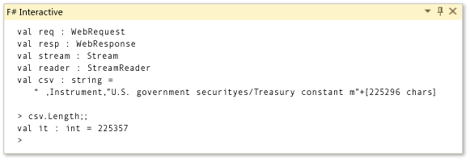

# Walkthrough: Using Visual F# to Create, Debug, and Deploy an Application
This walkthrough introduces you to the experience of using F# in [!INCLUDE[vsprvs](../vs140/includes/vsprvs_md.md)] together with .NET Framework 4.5.  
  
 In this walkthrough, you will learn how to get started with using [!INCLUDE[vsprvs](../vs140/includes/vsprvs_md.md)] to write F# applications through the example of a historical analysis of United States treasury interest-rate data. You will start with some quick analysis of the data by using the F# interactive window, then write and test some code to analyze the data, and then add a C# front end to explore integrating your F# code with other .NET languages.  
  
## Prerequisites  
 You need the following components to complete this walkthrough:  
  
-   [!INCLUDE[vsprvs](../vs140/includes/vsprvs_md.md)]  
  
 [!INCLUDE[note_settings_general](../vs140/includes/note_settings_general_md.md)]  
  
### To create an F# script  
  
1.  First, create an F# script. On the **File** menu, point to **New**, and then click **File**. In the **New File** dialog box, select **Script** in the **General** category under the **Installed** templates list and then select **F# Script File**. Click **Open** to create the file, and then save the file as <CodeContentPlaceHolder>4\</CodeContentPlaceHolder>.  
  
2.  Use .NET and F# APIs to access data from the Internet site of the United States Federal Reserve. Type in the following code.  
  
     [!code[FsFedRates#100](../vs140/codesnippet/FSharp/walkthrough--using-visual-fsharp-to-create--debug--and-deploy-an-application_1.fs)]  
  
     Notice the following:  
  
    -   Strings and keywords are colorized.  
  
    -   Completion lists appear after you type every period (.).  
  
    -   You can have Visual Studio complete method names and other identifiers by using the keyboard shortcut CTRL+SPACE or CTRL+J in the middle of an identifier. A completion list appears when you use CTRL+J.  
  
    -   When you rest the mouse pointer over any identifier in the code, you see a tooltip that contains information about that identifier.  
  
    -   If you press F1 when the cursor is in <CodeContentPlaceHolder>5\</CodeContentPlaceHolder>, the expected documentation appears.  
  
    -   If you press F1 when the cursor is in <CodeContentPlaceHolder>6\</CodeContentPlaceHolder>, the expected documentation appears.  
  
    -   Types and namespaces from <CodeContentPlaceHolder>7\</CodeContentPlaceHolder>, <CodeContentPlaceHolder>8\</CodeContentPlaceHolder>, and <CodeContentPlaceHolder>9\</CodeContentPlaceHolder> are referenced by default.  
  
    -   The <CodeContentPlaceHolder>10\</CodeContentPlaceHolder> value that is being set here is a property, not a constructor argument. F# allows you to set property values in this manner.  
  
    -   If you copy the URL in the example into a browser, you get back a list of comma-separated values that contain dates and interest rates, published by the United States Federal Reserve.  
  
3.  You will now execute the code by using F# Interactive. Select all the code (by using a mouse or by pressing CTRL+A) and right-click, and then click **Execute In Interactive**. (Alternatively, press ALT+ENTER.)  
  
    -   If it was not visible already, the F# Interactive window appears.  
  
    -   Code executes successfully.  
  
    -   The following appears in the F# Interactive window.  
  
<CodeContentPlaceHolder>0\</CodeContentPlaceHolder>  
4.  Next, inspect the data by using F# Interactive. At the F# Interactive prompt, type <CodeContentPlaceHolder>11\</CodeContentPlaceHolder> and then press ENTER. Type <CodeContentPlaceHolder>12\</CodeContentPlaceHolder> and then press ENTER. Notice the following:  
  
    -   The data is current.  
  
    -   F# Interactive displays the value of the string <CodeContentPlaceHolder>13\</CodeContentPlaceHolder> and its length, as shown here.  
  
<CodeContentPlaceHolder>1\</CodeContentPlaceHolder>  
    -   The following illustration shows the F# Interactive window.  
  
           
F# Interactive window  
  
5.  You will now write F# code to parse CSV (Comma-Separated Values) data. A CSV file is so named because it contains values separated by commas. In the Code Editor, add the following code. Also, add <CodeContentPlaceHolder>14\</CodeContentPlaceHolder> at the top of the file. As you add each line, select the code added in this section up to that line and press ALT+ENTER to see the partial results. Notice the following:  
  
    -   IntelliSense gives you helpful information after you type a period, even in the middle of complex nested expressions.  
  
    -   When code is incomplete (or incorrect), red wavy underlines indicate that syntactic and semantic errors appear in the code.  
  
    -   You create pipelines by using the pipe operator (<CodeContentPlaceHolder>15\</CodeContentPlaceHolder>). The pipe operator takes the return value from one expression and uses it as the argument for the function on the next line. Pipelines and F# Interactive allow for easy partial execution of data processing code.  
  
     [!code[FsFedRates#3](../vs140/codesnippet/FSharp/walkthrough--using-visual-fsharp-to-create--debug--and-deploy-an-application_2.fs)]  
  
6.  You will now give this functionality a name. Remove the series ID <CodeContentPlaceHolder>16\</CodeContentPlaceHolder> from the definition of <CodeContentPlaceHolder>17\</CodeContentPlaceHolder>, and replace it with <CodeContentPlaceHolder>18\</CodeContentPlaceHolder> to make the string literal a format string. Add <CodeContentPlaceHolder>19\</CodeContentPlaceHolder> after the format string. Select all code except the open directives, and press TAB. Above the indented block of code, add the following lines of code.  
  
     [!code[FsFedRates#41](../vs140/codesnippet/FSharp/walkthrough--using-visual-fsharp-to-create--debug--and-deploy-an-application_3.fs)]  
  
     At the end of the indented block, add <CodeContentPlaceHolder>20\</CodeContentPlaceHolder>. Notice the following:  
  
    -   Indentation is significant in F#. Indentation indicates nesting level.  
  
    -   TAB is almost like [Extract Method Refactoring (C#)](../vs140/extract-method-refactoring--csharp-.md).  
  
     The code now resembles the following.  
  
     [!code[FsFedRates#4](../vs140/codesnippet/FSharp/walkthrough--using-visual-fsharp-to-create--debug--and-deploy-an-application_4.fs)]  
  
7.  You will now use this functionality on new inputs. Select all the code and press ALT+ENTER to execute it by using F# Interactive. At the F# Interactive prompt, call the new <CodeContentPlaceHolder>21\</CodeContentPlaceHolder> function on other maturity rates: <CodeContentPlaceHolder>22\</CodeContentPlaceHolder>, <CodeContentPlaceHolder>23\</CodeContentPlaceHolder>, and <CodeContentPlaceHolder>24\</CodeContentPlaceHolder>, in years. Notice the following:  
  
    -   Previous definitions are not lost in F# Interactive, but new definitions are available.  
  
    -   Complex structured data is rendered by special printing functionality.  
  
### To develop a component by using F#  
  
1.  Create a library project to expose the functionality that you have created. On the **File** menu, point to **New** and then click **Project**. In the **New Project** dialog box, select **Visual F#** in the **Installed** list and then **F# Library** to create a new library project. Give the project the name <CodeContentPlaceHolder>25\</CodeContentPlaceHolder>. Copy the code that you created previously from <CodeContentPlaceHolder>26\</CodeContentPlaceHolder> and paste it into <CodeContentPlaceHolder>27\</CodeContentPlaceHolder>. Add a module declaration to the top of the file: <CodeContentPlaceHolder>28\</CodeContentPlaceHolder>. In **Solution Explorer**, rename <CodeContentPlaceHolder>29\</CodeContentPlaceHolder> to <CodeContentPlaceHolder>30\</CodeContentPlaceHolder>, and save the file. Notice the following:  
  
    -   The default F# Library template provides a code file that has the extension <CodeContentPlaceHolder>31\</CodeContentPlaceHolder> and a script that has the extension <CodeContentPlaceHolder>32\</CodeContentPlaceHolder>. You can use the script file to interactively test your library code.  
  
1.  You will now create an F# class that exposes the desired functionality. In **Solution Explorer**, right-click the project, point to **Add**, and then click **New Item**. In the **Add New Item** dialog box, select **F# Source File**. Name the file <CodeContentPlaceHolder>33\</CodeContentPlaceHolder>. Right-click **Script.fsx** in **Solution Explorer** and then click **Move Down**. (Alternatively, press ALT+DOWN ARROW.) Paste the following code into <CodeContentPlaceHolder>34\</CodeContentPlaceHolder>:  
  
     [!code[FsFedRates#5](../vs140/codesnippet/FSharp/walkthrough--using-visual-fsharp-to-create--debug--and-deploy-an-application_5.fs)]  
  
     Notice the following:  
  
    -   F# supports object-oriented programming concepts. For more information, see [Classes (F#)](../vs140/classes--fsharp-.md), [Inheritance (F#)](../vs140/inheritance--fsharp-.md), and other relevant topics in the F# Language Reference.  
  
2.  To build the project, press CTRL+SHIFT+B or F6. Notice the following:  
  
    -   The project builds successfully.  
  
    -   The Error List window shows no errors.  
  
    -   The output directory contains <CodeContentPlaceHolder>35\</CodeContentPlaceHolder>, <CodeContentPlaceHolder>36\</CodeContentPlaceHolder>, and <CodeContentPlaceHolder>37\</CodeContentPlaceHolder> files.  
  
    -   The Output window displays the following:  
  
<CodeContentPlaceHolder>2\</CodeContentPlaceHolder>  
3.  To add a C# client application, open the shortcut menu for the solution node, choose **Add**, and then choose **New Project**. In the **Add New Project** dialog box, choose **Visual C#** in the **Installed Templates** list, and then choose **Console Application**. You might have to expand the **Other Languages** node. Name the project <CodeContentPlaceHolder>38\</CodeContentPlaceHolder>, and then choose the **OK** button. Open the shortcut menu on this project's **References** node, and then choose **Add Reference**. Choose the **Solution** node, and then choose the **Projects** node. Select the check box next to the **RateAnalysis** project, and then choose the **OK** button. Open the shortcut menu for the **CSharpDriver** project node, and then click **Set as Startup Project**. Type the following code in the body of the <CodeContentPlaceHolder>39\</CodeContentPlaceHolder> method of the C# application.  
  
<CodeContentPlaceHolder>3\</CodeContentPlaceHolder>  
     Notice the following:  
  
    -   You can add project-to-project references to and from C# and F#.  
  
    -   You can use F# defined namespaces and types from C# like any other type.  
  
    -   F# documentation comments are available in C# IntelliSense.  
  
    -   C# can access tuple return values from the F# API. The tuples are \<xref:System.Tuple*> values in .NET Framework 4.5.  
  
4.  To debug the application, press F11 to build the application, start the application in the debugger, and step into the first line of executed code. Press F11 several more times until you step into F# code in the body of the <CodeContentPlaceHolder>40\</CodeContentPlaceHolder> member. Notice the following:  
  
    -   You can easily step from C# code into F# code.  
  
    -   Each expression in F# is a step in the debugger.  
  
    -   The Locals window shows the values of <CodeContentPlaceHolder>41\</CodeContentPlaceHolder>.  
  
    -   Continuing to press F11 steps through the evaluation of the rest of the application.  
  
    -   Debugger commands like **Run to Cursor**, **Set Next Statement**, **Insert Breakpoint**, **Add Watch**, and **Go to Disassembly** all work as expected.  
  
### To Deploy the Application  
  
1.  If you're still debugging, stop debugging by choosing the SHIFT + F5 keys or by opening the **Debug** menu and then choosing **Stop Debugging**.  
  
2.  Open the shortcut menu for the CSharpDriver project, and then choose **Properties**.  
  
3.  In the project designer, choose the **Publish** tab, which shows options for deploying your app.  
  
4.  Choose the **Publish Wizard** button.  
  
     The Publish Wizard starts, and the first screen asks where you want the published files to be placed.  
  
5.  In the text box, specify a file location on your local disk where you'd like the installation files for your app to be placed when you publish, or choose the **Browse** button to navigate to a location.  
  
6.  Choose the **Finish** button to accept all the defaults to build a standard setup that may be distributed to client machines, or choose the **Next** button to view other publishing options.  
  
     A setup executable and supporting files are published to the location that you specified.  
  
## Next Steps  
 Get started writing F# code by reading [How to: Create Your First F# Program](../vs140/walkthrough--your-first-fsharp-program.md), or learn about functions in F# by reading [Functions as First Class Values](../vs140/functions-as-first-class-values--fsharp-.md). You can explore the F# language by reading the [F# Language Reference](../vs140/fsharp-language-reference.md).  
  
## See Also  
 [Visual F# Walkthroughs](../vs140/visual-fsharp-samples-and-walkthroughs.md)   
 [Samples and Walkthroughs](../vs140/visual-fsharp-samples-and-walkthroughs.md)