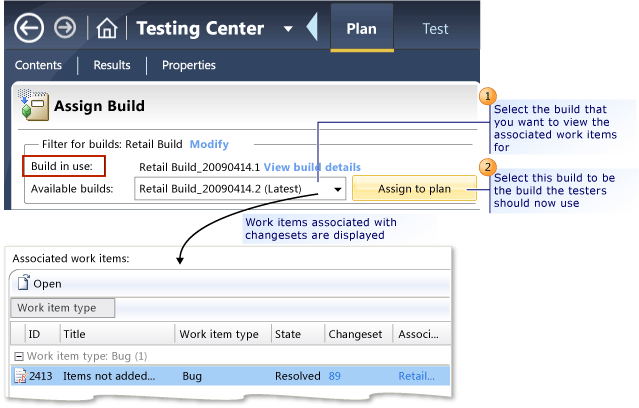

# What development has been done since a previous build?
After you select the build for your test plan that you are currently using, you can select a different build to see which work items have been associated with any builds between the test plan build and this selected build. [!INCLUDE[TCMext](../vs140/includes/tcmext_md.md)] shows the work items that have been associated with changesets checked in between any two builds, as shown in the following illustration. You can sort these work items by associated build or by the state of the work item.  
  
   
  
 **Requirements**  
  
-   Visual Studio Enterprise, [!INCLUDE[vstsTestEssLong](../vs140/includes/vststestesslong_md.md)]  
  
> [!NOTE]
>  To appear in this associated work items list, work items must be associated with the changeset when a user checks in code changes.  
  
### To determine changes between builds and use a new build for testing  
  
1.  Open [!INCLUDE[TCMext](../vs140/includes/tcmext_md.md)]. (Go to Start, All Programs, Microsoft Visual Studio, Microsoft Test Manager.)  
  
2.  To check changes between builds, choose the down-arrow on the center group selector and then choose **Testing Center**.  
  
3.  In the center group menu bar, choose **Track**.  
  
4.  Choose **Assign Build**.  
  
     The **Assign Build** activity is displayed and the available builds are shown based on your build filter.  
  
5.  (Optional) To display the work items for a different build, click **Available builds** and select a different build.  
  
     The work items are displayed in **Associated items**.  
  
6.  To use a new build for your testing for this test plan, choose **Available builds** and select a build and then choose **Assign to plan**.  
  
    > [!WARNING]
    >  By default, a build definition keeps the last ten builds. These are listed for you to select. To change the number of builds that are kept, you must change the retention policy for the build definition. For more information about how to do this, see the steps relating to the retention policy tab in the following topic: .  
  
     This build is now displayed in **Build in use**.  
  
    > [!NOTE]
    >  If this build differs from the latest build displayed in **Available builds**, based on the build filter for the test plan, **Associated items** now shows any work items associated with changesets that were checked in between the build that is now in use and the latest build.  
  
7.  (Optional) If you want to revert to an earlier build as your **Build in use**, choose **Modify** next to **Filter for builds**. The **Properties** activity is displayed.  
  
     Choose the drop-down arrow next to **Filter for builds**, choose **Clear all**, and then choose **Set build filter**. **Filter for builds** is now set to **Any definition or quality** and **Build in use** is set to **None**. You can now set your build filter again and choose the build you want to use for your plan.  
  
## See Also  
 [Determining Which Builds Have Bug Fixes, New Features or Requirements](../vs140/determine-changes-between-builds.md)   
 [How to: Select a Build For Your Test Plan](../vs140/how-to--select-a-build-for-your-test-plan.md)