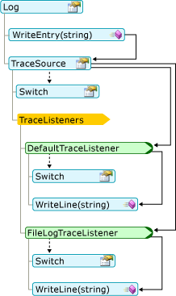
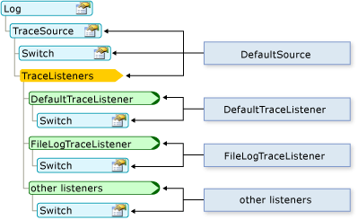

# Working with Application Logs in Visual Basic
The <CodeContentPlaceHolder>1\</CodeContentPlaceHolder> and <CodeContentPlaceHolder>2\</CodeContentPlaceHolder> objects make it easy to write logging and tracing information to logs.  
  
## How Messages are Logged  
 First, the severity of the message is checked with the \<xref:System.Diagnostics.TraceSource.Switch*> property of the log's \<xref:Microsoft.VisualBasic.Logging.Log.TraceSource*> property. By default, only messages of severity "Information" and higher are passed on to the trace listeners, specified in the log's <CodeContentPlaceHolder>3\</CodeContentPlaceHolder> collection. Then, each listener compares the severity of the message to the listener's \<xref:System.Diagnostics.TraceSource.Switch*> property. If the message's severity is high enough, the listener writes out the message.  
  
 The following diagram shows how a message written to the <CodeContentPlaceHolder>4\</CodeContentPlaceHolder> method gets passed to the <CodeContentPlaceHolder>5\</CodeContentPlaceHolder> methods of the log's trace listeners:  
  
   
  
 You can change the behavior of the log and the trace listeners by changing the application's configuration file. The following diagram shows the correspondence between the parts of the log and the configuration file.  
  
   
  
## Where Messages are Logged  
 If the assembly has no configuration file, the <CodeContentPlaceHolder>6\</CodeContentPlaceHolder> and <CodeContentPlaceHolder>7\</CodeContentPlaceHolder> objects write to the application's debug output (through the \<xref:System.Diagnostics.DefaultTraceListener*> class). In addition, the <CodeContentPlaceHolder>8\</CodeContentPlaceHolder> object writes to the assembly's log file (through the \<xref:Microsoft.VisualBasic.Logging.FileLogTraceListener*> class), while the <CodeContentPlaceHolder>9\</CodeContentPlaceHolder> object writes to the ASP.NET Web page's output (through the \<xref:System.Web.WebPageTraceListener*> class).  
  
 The debug output can be viewed in the [!INCLUDE[vsprvs](../vs140/includes/vsprvs_md.md)] **Output** window when running your application in debug mode. To open the **Output** window, click the **Debug** menu item, point to **Windows**, and then click **Output**. In the **Output** window, select **Debug** from the **Show output from** box.  
  
 By default, <CodeContentPlaceHolder>10\</CodeContentPlaceHolder> writes the log file in the path for the user's application data. You can get the path from the \<xref:Microsoft.VisualBasic.Logging.FileLogTraceListener.FullLogFileName*> property of the \<xref:Microsoft.VisualBasic.Logging.Log.DefaultFileLogWriter*> object. The format of that path is as follows:  
  
 <CodeContentPlaceHolder>11\</CodeContentPlaceHolder>\\<CodeContentPlaceHolder>12\</CodeContentPlaceHolder>\\<CodeContentPlaceHolder>13\</CodeContentPlaceHolder>\\<CodeContentPlaceHolder>14\</CodeContentPlaceHolder>  
  
 A typical value for <CodeContentPlaceHolder>15\</CodeContentPlaceHolder> is as follows.  
  
 C:\Documents and Settings\\<CodeContentPlaceHolder>16\</CodeContentPlaceHolder>\Application Data  
  
 The values of <CodeContentPlaceHolder>17\</CodeContentPlaceHolder>, <CodeContentPlaceHolder>18\</CodeContentPlaceHolder>, and <CodeContentPlaceHolder>19\</CodeContentPlaceHolder> come from the application's assembly information. The form of the log file name is *AssemblyName*.log, where *AssemblyName* is the file name of the assembly without the extension. If more than one log file is needed, such as when the original log is unavailable when the application attempts to write to the log, the form for the log file name is *AssemblyName*-*iteration*.log, where <CodeContentPlaceHolder>20\</CodeContentPlaceHolder> is a positive <CodeContentPlaceHolder>21\</CodeContentPlaceHolder>.  
  
 You can override the default behavior by adding or changing the computer's and the application's configuration files. For more information, see [Walkthrough: Changing Where My.Application.Log Writes Information](../vs140/walkthrough--changing-where-my.application.log-writes-information--visual-basic-.md).  
  
## Configuring Log Settings  
 The <CodeContentPlaceHolder>22\</CodeContentPlaceHolder> object has a default implementation that works without an application configuration file, app.config. To change the defaults, you must add a configuration file with the new settings. For more information, see [Walkthrough: Filtering My.Application.Log Output](../vs140/walkthrough--filtering-my.application.log-output--visual-basic-.md).  
  
 The log configuration sections are located in the <CodeContentPlaceHolder>23\</CodeContentPlaceHolder> node in the main <CodeContentPlaceHolder>24\</CodeContentPlaceHolder> node of the app.config file. Log information is defined in several nodes:  
  
-   The listeners for the <CodeContentPlaceHolder>25\</CodeContentPlaceHolder> object are defined in the <CodeContentPlaceHolder>26\</CodeContentPlaceHolder> node named DefaultSource.  
  
-   The severity filter for the <CodeContentPlaceHolder>27\</CodeContentPlaceHolder> object is defined in the <CodeContentPlaceHolder>28\</CodeContentPlaceHolder> node named DefaultSwitch.  
  
-   The log listeners are defined in the <CodeContentPlaceHolder>29\</CodeContentPlaceHolder> node.  
  
 Examples of <CodeContentPlaceHolder>30\</CodeContentPlaceHolder>, <CodeContentPlaceHolder>31\</CodeContentPlaceHolder>, and <CodeContentPlaceHolder>32\</CodeContentPlaceHolder> nodes are shown in the following code:  
  
<CodeContentPlaceHolder>0\</CodeContentPlaceHolder>  
## Changing Log Settings after Deployment  
 When you develop an application, its configuration settings are stored in the app.config file, as shown in the examples above. After you deploy your application, you can still configure the log by editing the configuration file. In a Windows-based application, this file's name is *applicationName*.exe.config, and it must reside in the same folder as the executable file. For a Web application, this is the Web.config file associated with the project.  
  
 When your application executes the code that creates an instance of a class for the first time, it checks the configuration file for information about the object. For the <CodeContentPlaceHolder>33\</CodeContentPlaceHolder> object, this happens the first time the <CodeContentPlaceHolder>34\</CodeContentPlaceHolder> object is accessed. The system examines the configuration file only once for any particular object—the first time your application creates the object. Therefore, you may need to restart the application for the changes to take effect.  
  
 In a deployed application, you enable trace code by reconfiguring switch objects before your application starts. Typically, this involves turning the switch objects on and off or by changing the tracing levels, and then restarting your application.  
  
## Security Considerations  
 Consider the following when writing data to the log:  
  
-   **Avoid leaking user information.** Ensure that your application writes only approved information to the log. For example, it may be acceptable for the application log to contain user names, but not user passwords.  
  
-   **Make log locations secure.** Any log that contains potentially sensitive information should be stored in a secure location.  
  
-   **Avoid misleading information.** In general, your application should validate all data entered by a user before using that data. This includes writing data to the application log.  
  
-   **Avoid denial of service.** If your application writes too much information to the log, it could fill the log or make finding important information difficult.  
  
## See Also  
 \<xref:Microsoft.VisualBasic.Logging.Log*?displayProperty=fullName>   
 [Logging Information from the Application](../vs140/logging-information-from-the-application--visual-basic-.md)